<div align="center">
<a href="https://github.com/algorandfoundation/algokit-cli"></a>
</div>

<p align="center">
    <a target="_blank" href="https://github.com/algorandfoundation/algokit-cli/blob/main/docs/algokit.md"></a>
    <a target="_blank" href="https://dev.algorand.co/algokit/algokit-intro"></a>
    <a target="_blank" href="https://github.com/algorandfoundation/algokit-cli"></a>
    <a target="_blank" href="https://dev.algorand.co/algokit/algokit-intro"></a>
</p>

---

The Algorand AlgoKit CLI is the one-stop shop tool for developers building on the [Algorand network](https://www.algorand.com/).

AlgoKit gets developers of all levels up and running with a familiar, fun and productive development environment in minutes. The goal of AlgoKit is to help developers build and launch secure, automated production-ready applications rapidly.

[Install AlgoKit](#install) | [Quick Start Tutorial](https://github.com/algorandfoundation/algokit-cli/blob/main/docs/tutorials/intro.md) | [Documentation](https://github.com/algorandfoundation/algokit-cli/blob/main/docs/algokit.md)

## What is AlgoKit?

AlgoKit compromises of a number of components that make it the one-stop shop tool for developers building on the [Algorand network](https://www.algorand.com/).


AlgoKit can help you [**learn**](#learn), [**develop**](#develop) and [**operate**](#operate) Algorand solutions. It consists of [a number of repositories](https://github.com/search?q=org%3Aalgorandfoundation+algokit-&type=repositories), including this one.

### Learn

There are many learning resources on the [Algorand Developer Portal](https://dev.algorand.co/) and the [AlgoKit landing page](https://dev.algorand.co/algokit/algokit-intro) has a range of links to more learning materials. In particular, check out the [quick start tutorial](https://dev.algorand.co/getting-started/algokit-quick-start/).

If you need help you can access both the [Algorand Discord](https://discord.gg/84AActu3at) (pro-tip: check out the algokit channel!) and the [Algorand Forum](https://forum.algorand.org/).

We have also developed an [AlgoKit video series](https://www.youtube.com/@algodevs/playlists).

### Develop

AlgoKit helps you develop Algorand solutions:

- **Interaction**: AlgoKit exposes a number of interaction methods, namely:
  - [**AlgoKit CLI**](https://github.com/algorandfoundation/algokit-cli/blob/main/docs/algokit.md): A Command Line Interface (CLI) so you can quickly access AlgoKit capabilities
  - [VS Code](https://code.visualstudio.com/): All AlgoKit project templates include VS Code configurations so you have a smooth out-of-the-box development experience using VS Code
  - [lora](https://lora.algokit.io/): AlgoKit has integrations with lora; a web-based user interface that let's you visualise and interact with an Algorand network
- **Getting Started**: AlgoKit helps you get started quickly when building new solutions:
  - [**AlgoKit Templates**](https://github.com/algorandfoundation/algokit-cli/blob/main/docs/features/init.md): Template libraries to get you started faster and quickly set up a productive dev experience
- **Development**: AlgoKit provides SDKs, tools and libraries that help you quickly and effectively build high quality Algorand solutions:
  - **AlgoKit Utils** ([Python](https://github.com/algorandfoundation/algokit-utils-py#readme) | [TypeScript](https://github.com/algorandfoundation/algokit-utils-ts#readme)): A set of utility libraries so you can develop, test, build and deploy Algorand solutions quickly and easily
    - [Algorand SDKs](https://dev.algorand.co/reference/sdks/sdk-list/) - The core Algorand SDK providing Algorand protocol API calls, which AlgoKit Utils wraps, but still exposes for advanced scenarios
  - [**Algorand Python**](https://github.com/algorandfoundation/puya): A semantically and syntactically compatible, typed Python language that works with standard Python tooling and allows you to express smart contracts (apps) and smart signatures (logic signatures) for deployment on the Algorand Virtual Machine (AVM).
  - [**Algorand TypeScript (Beta)**](https://github.com/algorandfoundation/puya-ts): A semantically and syntactically compatible, typed TypeScript language that works with standard TypeScript tooling and allows you to express smart contracts (apps) and smart signatures (logic signatures) for deployment on the Algorand Virtual Machine (AVM). This language is currently in beta.
  - [**TEALScript**](https://github.com/algorandfoundation/TEALScript): A subset of TypeScript that can be used to express smart contracts (apps) and smart signatures (logic signatures) for deployment on the Algorand Virtual Machine (AVM).
  - [**AlgoKit LocalNet**](https://github.com/algorandfoundation/algokit-cli/blob/main/docs/features/localnet.md): A local isolated Algorand network so you can simulate real transactions and workloads on your computer

### Operate

AlgoKit can help you deploy and operate Algorand solutions.

AlgoKit comes with out-of-the-box [Continuous Integration / Continuous Deployment (CI/CD) templates](https://github.com/algorandfoundation/algokit-python-template) that help you rapidly set up best-practice software delivery processes that ensure you build quality in and have a solution that can evolve

## What can AlgoKit help me do?

The set of capabilities supported by AlgoKit will evolve over time, but currently includes:

- Quickly run, explore and interact with an isolated local Algorand network (LocalNet)
- Building, testing, deploying and calling [Algorand Python](https://github.com/algorandfoundation/puya) / [Algorand TypeScript (Beta)](https://github.com/algorandfoundation/puya-ts) / [TEALScript](https://github.com/algorandfoundation/TEALScript) smart contracts

For a user guide and guidance on how to use AlgoKit, please refer to the [docs](https://github.com/algorandfoundation/algokit-cli/blob/main/docs/algokit.md).

Future capabilities are likely to include:

- Quickly deploy [standardised](https://github.com/algorandfoundation/ARCs/#arcs-algorand-requests-for-comments), audited smart contracts
- Building and deploying Algorand dApps

## Is this for me?

The target audience for this tool is software developers building applications on the Algorand network. A working knowledge of using a command line interfaces and experience using the supported programming languages is assumed.

## How can I contribute?

This is an open source project managed by the Algorand Foundation. See the [contributing page](https://github.com/algorandfoundation/algokit-cli/blob/main/CONTRIBUTING.md) to learn about making improvements to the CLI tool itself, including developer setup instructions.

# Install

> **Note** Refer to [Troubleshooting](#troubleshooting) for more details on mitigation of known edge cases when installing AlgoKit.

## Prerequisites

No prerequisites are required to install AlgoKit itself. The install script handles everything.

Depending on the features you choose to leverage from the AlgoKit CLI, additional dependencies may be required.
The AlgoKit CLI will tell you if you are missing one for a given command. These optional dependencies are:

- **Git**: Essential for creating and updating projects from templates. Installation guide available at [Git Installation](https://git-scm.com/book/en/v2/Getting-Started-Installing-Git).
- **Docker**: Necessary for running the AlgoKit LocalNet environment. Docker Compose version 2.5.0 or higher is required. See [Docker Installation](https://docs.docker.com/get-docker/).
- **Node.js**: For those working on frontend templates or building contracts using Algorand TypeScript or TEALScript. **Minimum required versions are Node.js `v22` and npm `v10`**. See [Node.js Installation](https://nodejs.org/en/download/).

## Quick Install (Recommended)

AlgoKit is installed via [uv](https://docs.astral.sh/uv/), which handles Python and dependency management automatically.

### macOS / Linux

```shell
curl -fsSL https://cli.algokit.io/install.sh | bash
```

### Windows (PowerShell)

```powershell
irm https://cli.algokit.io/install.ps1 | iex
```

### What the installer does

1. Installs [uv](https://docs.astral.sh/uv/) if not already present
2. Installs Python 3.12 via uv if not already available
3. Installs AlgoKit via `uv tool install algokit`

### Maintenance

- To update AlgoKit: `uv tool upgrade algokit`
- To remove AlgoKit: `uv tool uninstall algokit`

## Alternative: Install with uv directly

If you already have [uv](https://docs.astral.sh/uv/) installed:

```shell
uv tool install algokit
```

## Legacy Installation Methods

> **Note**
> The following installation methods are being phased out in favor of the uv-based installation above.
> They will continue to work for existing installations but are no longer the recommended approach.

<details>
<summary>Click to expand legacy installation methods</summary>

### Install AlgoKit on Windows (winget)

1. Ensure prerequisites are installed
   - [WinGet](https://learn.microsoft.com/en-us/windows/package-manager/winget/) (should be installed by default on recent Windows 10 or later)
   - [Git](https://github.com/git-guides/install-git#install-git-on-windows) (or `winget install git.git`)
   - [Docker](https://docs.docker.com/desktop/install/windows-install/) (or `winget install docker.dockerdesktop`)

2. Install using winget

   ```shell
   winget install algokit
   ```

### Install AlgoKit on Mac (Homebrew)

1. Ensure prerequisites are installed
   - [Homebrew](https://docs.brew.sh/Installation)
   - [Git](https://github.com/git-guides/install-git#install-git-on-mac) (should already be available if `brew` is installed)
   - [Docker](https://docs.docker.com/desktop/install/mac-install/), (or `brew install --cask docker`)

2. Install using Homebrew

   ```shell
   brew install algorandfoundation/tap/algokit
   ```

### Install AlgoKit on Linux (snap)

1. Ensure prerequisites are installed
   - [Snap](https://snapcraft.io/docs/installing-snapd)
   - [Git](https://github.com/git-guides/install-git#install-git-on-linux)
   - [Docker](https://docs.docker.com/desktop/install/linux-install/)

2. Install using snap

   ```shell
   sudo snap install algokit --classic
   ```

### Install AlgoKit with pipx on any OS

1. Ensure desired prerequisites are installed
   - [Python 3.10 - 3.14](https://www.python.org/downloads/)
   - [pipx](https://pypa.github.io/pipx/installation/)
   - [Git](https://github.com/git-guides/install-git)
   - [Docker](https://docs.docker.com/get-docker/)

2. Install using pipx

   ```shell
   pipx install algokit
   ```

</details>

## Verify installation

Verify AlgoKit is installed correctly by running `algokit --version` and you should see output similar to:

```
algokit, version 2.10.2
```

> **Note**
> If you receive one of the following errors:
>
> - `command not found: algokit` (bash/zsh)
> - `The term 'algokit' is not recognized as the name of a cmdlet, function, script file, or operable program.` (PowerShell)
>
> Ensure that `~/.local/bin` is on your PATH and restart the terminal.

It is also recommended that you run `algokit doctor` to verify there are no issues in your local environment and to diagnose any problems if you do have difficulties running AlgoKit.

## Troubleshooting

This section addresses specific edge cases and issues that some users might encounter when interacting with the CLI. The following table provides solutions to known edge cases:

| Issue Description                                               | OS(s) with observed behaviour | Steps to mitigate                                                                            | References                                                           |
| --------------------------------------------------------------- | ----------------------------- | -------------------------------------------------------------------------------------------- | -------------------------------------------------------------------- |
| Python was built without `--with-ssl` flag, causing pip to fail | Debian 12                     | Run `sudo apt-get install -y libssl-dev` and reinstall python with `--with-ssl` flag enabled | [setup-python#93](https://github.com/actions/setup-python/issues/93) |
