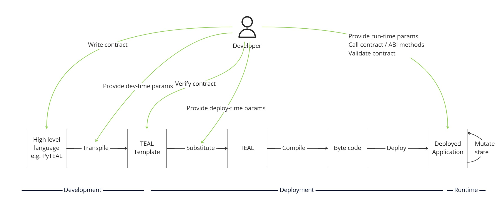

# Smart Contract Deployment

- **Status**: Approved
- **Owner:** Rob Moore
- **Deciders**: Anne Kenyon (Algorand Inc.), Alessandro Cappellato (Algorand Foundation), Fabrice Benhamouda (Algorand Foundation)
- **Date created**: 2023-01-12
- **Date decided:** 2023-02-04
- **Date updated**: 2023-02-04

## Context

AlgoKit will provide an end-to-end development and deployment experience that includes support for the end-to-end smart contract development lifecycle:

1. Development
   1. **Write** smart contracts
   2. **Transpile** smart contracts with development-time parameters to TEAL Templates
   3. **Verify** the TEAL Templates maintain [output stability](../articles/output_stability.md) and any other static code quality checks
2. Deployment
   1. **Substitute** deploy-time parameters into TEAL Templates to create final TEAL code
   2. **Compile** the TEAL to create byte code using algod
   3. **Deploy** the byte code to one or more Algorand networks (e.g. LocalNet, TestNet, MainNet) to create Deployed Application(s)
3. Runtime
   1. **Validate** the deployed app via automated testing of the smart contracts to provide confidence in their correctness
   2. **Call** deployed smart contract with runtime parameters to utilise it



The default Development experience that AlgoKit exposes will be via Beaker, however AlgoKit is modular and extensible so other tooling can also be used.

This decision record covers the different options and high level design for how AlgoKit aims to cover Deployment and Runtime.

## Requirements

- We support the different activities defined above under Deployment and Runtime: Substitute, Compile, Deploy, Validate and Call
- We support the ability to provide dev-time (e.g. static values that are passed into instances of a contract that get output), deploy-time (e.g. network specific addresses or IDs, etc.) and run-time (e.g. call arguments) values to smart contracts
- We support deploying smart contracts that have been output by any means (Beaker or otherwise) that creates TEAL templates (logic signature or approval & clear) and (for an app) an [ABI](https://github.com/algorandfoundation/ARCs/blob/main/ARCs/arc-0004.md) and an [app spec](https://github.com/algorandfoundation/ARCs/pull/150)
- We support calling smart contracts with multiple languages / programming ecosystems (with AlgoKit providing Python and TypeScript implementations)
- We support generating type-safe smart contract clients based on the smart contract definition
- We support deploying smart contracts to AlgoKit LocalNet, TestNet and Mainnet
- We support deploying manually and via continuous deployment pipeline

## Principles

- [AlgoKit Guiding Principles](../../docs/algokit.md#Guiding-Principles) - specifically:
  - **Cohesive developer tool suite**
  - **Seamless onramp**
  - **Secure by default**
  - **Modular components**
- **Continuous Delivery** - support the ability for software developers to adopt a [Continuous Delivery](https://continuousdelivery.com/) approach to reduce risk, namely by supporting:
  - [Deployment pipelines](https://continuousdelivery.com/implementing/patterns/#the-deployment-pipeline) that build once and deploy to similar environments (that bit is nicely facilitated by the blockchain!) consistently
  - [Automated testing](https://continuousdelivery.com/implementing/architecture/)
- **Facilitate correctness** - smart contract development is higher risk than many other types of development, standard practice involves deploying an immutable contract that must be right from the beginning; AlgoKit should help developers fall into the pit of success and produce higher quality output that is more likely to be correct while having flexibility to opt-in to other behaviours as needed

## Decisions and design

The following design decisions need to be considered, and are discussed below:

- TEAL Templates and deploy-time parameter substitution
- Generated / Type-safe clients
- Deployment and development decoupling
- Upgradeable and deletable contracts
- Mnemonic storage and retrieval
- Contract identification
- Automated vs manual deployments
- Output stability testing
- Validation testing

### TEAL Templates and deploy-time parameter substitution

The above diagram includes a TEAL Templates step separate from the final TEAL that gets deployed. A fair question may be to ask if this extra step is really needed?

There are two key considerations to help answer this question:

1. Should development and deployment be decoupled from each other (i.e. happen at a separate time)?
   - If we couple development and deployment together then it necessitates that at deploy time you have the same programming environment running that's needed for the smart contract development. So, if you (for instance) were building a smart contract in Python using PyTEAL or Beaker, but deploying the smart contract using TypeScript that means you need a deployment environment that supports both Node.js _and_ Python. This makes it harder to follow the Modular components principle.
   - If development and deployment are coupled together it rules out using Continuous Delivery since it forces you to build the deployment artifact at the same time as you are deploying it. This means you miss out on the confidence and risk benefit of knowing that when you are deploying to (say) MainNet you are deploying the same artifact that was successfully deployed and tested on (say) TestNet and AlgoKit LocalNet (let alone passes any other checks you decide to run as part of Continuous Integration like automated tests, static code analysis, etc.).
   - If development and deployment are coupled together it means we aren't perform an [output stability](../articles/output_stability.md) test so we don't get notified if we make a change that results in a different smart contract (which may then affect things like hashes for smart contract auditing review comparison, unintended introduction of security vulnerabilities, etc.).
   - Based on all of this, decoupling development and deployment is a very helpful thing for a smart contract and aligns with all of the above-stated principles more closely.
2. Do we need to provide deploy-time parameters?
   - When deploying a smart contract to a network (say MainNet), there are likely to be certain parameters that will be different from deploying to a different network (say TestNet), e.g.:
     - If you are calling another smart contract, say an Oracle, then the application ID will change between networks.
     - If you have standard prices you may decide to make them smaller on the TestNet contract given it's much harder to get access to a reasonable number of ALGOs on TestNet (without knowing the right people, or painfully clicking repeatedly on a CAPTCHA on one of the dispensers repeatedly to get 10 ALGOs at a time).
     - If you are providing admin permissions for a statically defined account (hardcoded for security reasons) then it's likely you would use a different account address for MainNet vs TestNet so you don't expose a production mnemonic in test infrastructure.
     - etc.
   - Based on all of this, being able to provide deploy-time parameters is an important feature.

Because it makes sense to decouple development and deployment, but also important to be able to provide deploy-time parameters, that means it's necessary to support deploy-time parameter substitution and thus: TEAL that is output from the development stage should be considered a template that may have deploy-time substitutions performed on it.

Thankfully, this is supported as a first-class concept in PyTEAL via the [`Tmpl` feature](https://pyteal.readthedocs.io/en/stable/api.html?highlight=TMPL#pyteal.Tmpl) and could be similarly mimicked in any other TEAL transpilation language.

### Generated / Type-safe clients

Smart contract development results in an on-chain program that can be invoked from a "client". The development of the client itself has two broad options:

1. Hand-code the client for a given smart contract using basic primitives (such as being able to issue a smart contract call of a certain type with an array of arguments)
2. Generate the client based on the smart contract definition and then call methods on the client that correspond to methods in the smart contract

The second option, while more complex, results in an easier, faster, and safer developer experience:

- You don't need to understand as much about the underlying blockchain calls since they will be constructed for you so the frontends (e.g. dApps) don't have to be constructed by smart contract / web3 experts
- You can have type-safe / intellisensed client SDKs, in multiple programming languages with no extra effort beyond writing the smart contract - making the developer experience much easier and meeting devs where they are
- Using a typed client means that smart contract calls (against the same version of the smart contract the client was generated from) will always be correct and should succeed so the client code is more likely to be correct and can be statically checked for correctness

Because of this, the desired experience for AlgoKit is to encourage and directly support a generated / type-safe client experience. The intention is to drive this from a combination of [ARC-0004](https://github.com/algorandfoundation/ARCs/blob/main/ARCs/arc-0004.md) and [ARC-0032](https://github.com/algorandfoundation/ARCs/pull/150).

To illustrate what the end result looks like consider the following Beaker smart contract:

```python
from beaker.application import Application
from beaker.decorators import Authorize, delete, external
from pyteal import Approve, Bytes, Concat, Expr, Global
from pyteal.ast import abi


class HelloWorld(Application):
    @external(read_only=True)
    def hello(self, name: abi.String, *, output: abi.String) -> Expr:
        return output.set(Concat(Bytes("Hello, "), name.get()))

    @delete(authorize=Authorize.only(Global.creator_address()))
    def delete(self) -> Expr:
        return Approve()
```

Let's say you wanted to deploy and interact with that smart contract using TypeScript; if you didn't have a client generated from that code then you would need to construct the method call:

```typescript
// Assume `appId`, `algod` and `senderAccount` are already in scope
const composer = new AtomicTransactionComposer();
composer.addMethodCall({
  appID: appId,
  method: new ABIMethod({
    name: "hello",
    args: [{ name: "name", type: "string" }],
    returns: { type: "string" },
  }), // Not type-safe, no intellisense
  sender: senderAccount.addr,
  signer: makeBasicAccountTransactionSigner(senderAccount),
  suggestedParams: await algod.getTransactionParams().do(),
  methodArgs: ["World!"], // Not type-safe, no intellisense
});
const result = await composer.execute(algod, 5);
console.log(result.methodResults[0].returnValue); // Hello, World!
```

If instead you generated a client you could having something like this, which gives you intellisense and is type-safe:

```typescript
// Assume `appId`, `algod` and `senderAccount` are already in scope
// HelloWorldAppClient is generated from the smart contract definition (ABI json and app spec json)
const app = new HelloWorldAppClient(appId, algod, senderAccount);
const result = app.hello({ name: "World!" }); // Type-safe and intellisense
console.log(result); // Hello, World!
```

To be fair, you could have a middle-ground and load the ABI json to populate the `method` parameter of the `addMethodCall` call, but the `methodArgs` are still problematic and there is still no intellisense.

The suggested implementation for AlgoKit v1 is to provide a basic type-safe TypeScript client (leveraging either the MakerX TypeScript generator or [beaker-ts](https://github.com/algorand-devrel/beaker-ts)) and leave Python with the semi-typed implementation that Beaker currently exposes (with implementing a fully typed Python client as a future implementation effort).

### Deployment and development decoupling

As discussed above, decoupling deployment and development of smart contracts is a useful technique.

One of the advantages is it allows you to use separate programming languages for the writing of a smart contract and the deployment and automated testing of it. Separate, but related, it also makes it easier to generate type-safe clients (per the previous point) because there is an intermediate output from the development stage that can then be used to generate a client, in a separate (or the same) programming language, before using that client to then deploy and interact with the smart contract (for an end user experience, a programmatic interaction or an automated test).

This helps us follow the "Meet devs where they are" principle and provide optionality for developers to select the programming environment they are most comfortable with for writing clients and automated tests.

### Upgradeable and deletable contracts

Smart contracts are a powerful capability that can be used for anything from locking billions of dollars of value to implementing the mechanics of a game's state storage. This means there are different risk profiles, rigour and functionality evolution characteristics in different circumstances.

These different risk profiles have an impact on the functionality that is exposed within a smart contract. Two key examples of this are:

- **Upgradeable smart contracts** - Whether or not a smart contract can be updated inline (and keep existing state and app ID / address characteristics) or they are immutable
- **Deletable smart contracts** - Whether or not a smart contract can be deleted or is permanent

Immutability and permanence are useful architectural properties in certain circumstances (similarly mutability and impermanence in others). For example:

- If you have a smart contract that locks billions of dollars of value, then allowing that smart contract to be upgradeable allows for the manager of the smart contract to make a change that lets them steal the value.
- If you have a smart contract that provides an Oracle service (say for betting odds), then allowing that smart contract to be deletable could break many other applications that are hard-coded to call that Oracle contract's app ID.
- If you have a smart contract that runs the mechanics of a game engine the players of said game may have a reasonable expectation that the game engine is evolved and enhanced over time, but they don't want to lose their state (so upgrading the smart contract is useful).
- If you have a smart contract that handles a one-off trade of value across a cross-chain bridge then it makes sense to delete it (only once trade has been concluded) to remove noise, potential confusion and operational overhead for the operators of said bridge.

All 4 scenarios above provide different situations where immutability and permanence are desired or undesired. If you choose incorrectly for your circumstance, particularly for high-risk scenarios, the consequences could be major.

If a contract is immutable, it does limit the ability to evolve the functionality over time based on user feedback and also discourages use of best practice software delivery techniques that encourage evolution and rapid deployment like Continuous Delivery.

Another consideration in favour of immutability is smart contract auditing. If a smart contract is audited for security, but then the smart contract is upgradeable or is changed between when the audit occurred and when the contract was deployed to MainNet then the smart contract audit is somewhat invalidated and certainly any hashes that are provided of the smart contract code in an audit report will no longer match.

There are techniques that can be used to allow for immutable smart contracts, but let them be evolved somewhat:

- You could release a new version of a smart contract and include an ability for that smart contract to communicate to/from the existing smart contract to migrate state.
- You could ensure that clients can dynamically find the latest smart contract so the application ID / address doesn't need to be hardcoded and the smart contract remains addressable.
  - This could be done via some sort of on-chain or off-chain lookup, and/or by encoding information into the creation transaction note of the smart contract app.
- You could limit MainNet releases to major upgrades that happen infrequently and let users opt-in to whether or not they use the new version or not, and having a set of calls the user can sign to migrate their state/value from one contract to the next.

Lastly, it's worth noting that having fast development feedback loops during development and testing of smart contracts is likely a very useful feature to improve the development experience and speed. For this reason, allowing contracts to be upgraded or at the very least deleted (and then recreated) is likely very useful, but potentially when deployed to MainNet a switch could be made to disallow upgrading / deleting (as relevant).

The goal of AlgoKit is to create a development experience that is productive and easy, but also one that is secure by default and helps developers fall into the pit of success. For that reason, and given the consequences of getting this wrong the suggested approach AlgoKit takes is:

- All provided smart contract templates are by default immutable
- An immutability automated test is included by default to ensure that smart contracts can't be upgraded by the contract creator (this would have to be deleted by a developer, who is then opting in to the consequences of that)
- All provided smart contract templates are by default permanent when deployed to MainNet, but deletable elsewhere to facilitate an iterative development experience
- Client code will include mechanisms to dynamically find deployed applications in LocalNet and TestNet environments to support delete/recreate flows and improve the developer experience
- MainNet deployments will immediately (i.e. before any usage occurs) check that smart contracts are not upgradeable by the creator account by default (with an explicit opt-out option available for smart contracts that are meant to be upgradeable, which in turn will issue a warning to the developer to explain the implications)
- MainNet deployments will immediately (i.e. before any usage occurs) check that smart contracts are not deletable by the creator account by default (with an explicit opt-out option available for smart contracts that are meant to be deletable, which in turn will issue a warning to the developer to explain the implications)

### Mnemonic storage and retrieval

When deploying and interacting with a smart contract, you need to have access to the private key of an account. This is a secret and must be handled with care, as exposing a private key can be disastrous, and while [rekeying](https://developer.algorand.org/docs/get-details/accounts/rekey/) is possible if it's not done fast enough you can still lose assets, be victim to malicious calls and experience a painful user experience going forward (wallet support for rekeyed accounts is limited).

Another consideration is the network being deployed to / called. If you are interacting with the LocalNet network then mnemonics are all, but meaningless since you can simply reset the LocalNet and regenerate new accounts on the fly (and fund them with essentially unlimited ALGOs). If you are interacting with TestNet then mnemonics may hold TestNet ALGOs, which while difficult to get in large numbers, are more an inconvenience than a serious commercial problem to lose.

Finally, when interacting with LocalNet to create a smooth developer experience it's ideal to automatically generate and fund any accounts that are being used so the developer doesn't have to manually do this every time the LocalNet is reset. Even better, it's ideal if this can be done in a way that idempotently gets a consistently private key for a given "named account" so that subsequent calls use the same account (mimicking what happens in TestNet or MainNet when using a particular private key for a given "named account").

Given all of this, the suggested approach that AlgoKit takes is:

- LocalNet accounts are by default automatically and idempotently generated against a named account by using a named wallet via [Kmd](https://developer.algorand.org/docs/clis/kmd/) and are automatically funded using the LocalNet faucet account (the private key for which is automatically retrieved using Kmd).
- Where they are needed mnemonics will be provided using environment variables to follow [twelve factor app conventions](https://12factor.net/config), this is an industry standard approach to handling secrets and is easy to support cross-platform and cross-programming language as well as using encrypted secrets on CI/CD pipelines.
- An option will be provided for deployments that allows for deployments using ephemeral accounts that then get rekeyed to a separate, known [break-glass](https://www.beyondtrust.com/blog/entry/provide-security-privileged-accounts-with-break-glass-process) account (the private key of which is not available to the deploying process) will be provided to allow for developers to deploy using a break-glass setup.
- A `DISPENSER_MNEMONIC` environment variable will be expected when deploying to non-LocalNet environments, and will be encouraged to be a separate account just used for that purpose to limit [blast radius](https://www.lepide.com/blog/what-is-a-blast-radius-in-data-security-terms/), so that funds needed for deployments or calls can be automatically provided by convention, including for ephemeral accounts.
- The Algokit CLI will allow for mnemonics to be provided to it for a given project, which will get stored in a encrypted form within the .gitignore'd `.env` file with a project-specific random encryption key stored on that machine. This prevents cursory exploitation and accidental exposure through screen-sharing, but won't protect users with an exploited machine from having them exposed. For this reason, developers will be discouraged from storing MainNet mnemonics in that way and will need to acknowledge that risk.
- AlgoKit will provide example CI/CD templates that illustrate how to construct a deployment pipeline that includes MainNet deployments using secret storage for mnemonics so developers won't need to handle MainNet mnemonics on their local machine.

### Contract identification

Being able to identify an existing deployed instance of a given smart contract is very useful:

- It avoids the need to hardcode application IDs
- It makes things easier to automate, including automated deployments and testing of smart contracts and the apps that call them
- It allows the deployer of a smart contract to detect if that smart contract is already deployed and if so handle it appropriately (e.g. do nothing vs upgrade vs delete and create vs leave alone and create) depending on whether that smart contract is immutable and/or permanent and the network being deployed to (e.g. LocalNet vs TestNet vs MainNet)

As soon as a contract is not immutable, or is immutable and not permanent then the application ID of the smart contract for a given network will change over time. And, if a smart contract is immutable and permanent then net new versions may still be deployed, or at the very least the contract will change across networks (e.g. LocalNet vs TestNet vs MainNet). Because of this it's important to support dynamic resolution of application IDs.

It's important to consider whether the smart contract needs to be resolved on-chain or off-chain.

Resolving on-chain is harder to achieve dynamically, but there are some patterns that can be used, e.g.:

- Storing the application ID in (e.g. Global) state and providing a creator-only ABI method that can be called as part of deployment of the dependant contract to update the stored application ID.
- [Lookup/registry contract](https://research.csiro.au/blockchainpatterns/general-patterns/contract-structural-patterns/contract-registry/) that returns the ID of a named contract and that lookup contract allows said ID to be updated.
- [Proxy contract](https://blog.openzeppelin.com/proxy-patterns/) that mirrors the interface of the parent contract but delegates calls to an underlying contract whose ID can be updated.
- [Other patterns](https://ethereum.org/en/developers/docs/smart-contracts/upgrading/#what-is-a-smart-contract-upgrade).

Resolving off-chain can be done through a variety of ways, e.g.:

- Create a contract discovery service API that allows new contracts to be registered by API call after being deployed.
- If the contract creator account is always known (i.e. ephemeral creator accounts aren't being used) then it's possible to identify a contract by name by encoding a payload into the application creation transaction note and then using the indexer to find the application creation transactions for a given account and working backwards to find the relevant application ID.
- If the contract creator account is always known (i.e. ephemeral creator accounts aren't being used) then it's possible to identify a contract by name by encoding the name in to one of the [application params](https://developer.algorand.org/docs/rest-apis/algod/v2/#applicationparams) (e.g. approval program or using a global state variable) and looking up the `created-apps` property when [retrieving an account via algod](https://developer.algorand.org/docs/rest-apis/algod/v2/#account).
- Create a contract discovery service API that scans the blockchain transactions ([example](https://developer.algorand.org/articles/developer-preview-of-conduit-a-new-way-to-access-algorand-chain-data/)) to automatically maintain a record of smart contract IDs.
- Use CI/CD variables ([example](https://docs.github.com/en/actions/using-workflows/workflow-commands-for-github-actions#setting-an-output-parameter)) to propagate the deployed app ID to the configuration on the deployment of the client (assuming the same pipeline is used for deployment of smart contract and client(s)).
- Manually set the application ID via the CI/CD pipeline of the clients with environment-specific values (that are passed in via environment variables) and change them to reflect any changes to the smart contracts (note: this isn't sustainable for frequently changing contracts, but is a simple method for infrequently changing contracts).

In order to provide the simplest implementation possible to handle this complexity, AlgoKit v1 will:

- Add payloads to application creation transactions to allow them to be resolved by name for a known creator account using the indexer.
- Allow application IDs to be resolved by name using environment variables for situations where a developer is using ephemeral creator accounts.
- On-chain resolution will be left for developers to implement (likely by hardcoding or Global-state-based configurable application IDs).

More sophisticated options could potentially by implemented in the future.

### Automated vs manual deployments

In order to support Continuous Delivery for smart contracts there is a need to support automated deployments of smart contracts via deployment pipeline.

This presents a number of challenges to solve for though:

- The deployment pipeline needs to determine if the smart contract already exists or not in the network being deployed to
- Depending on whether the contract is immutable and/or permanent and if it already exists or not in the network being deployed to, the pipeline needs to handle upgrade, deletion and/or creation of the contract (and this behaviour may need to be switched depending on the network being deployed to)
- In order to protect integrity of MainNet contracts the deployment process should probably have some safeguards for MainNet that by default prevent destructive operations and require some kind of human opt-in to perform those operations
- Exposing private key mnemonics for MainNet necessitates they are "hot wallets" which may be undesirable for privileged accounts responsible for high value smart contracts (e.g. smart contracts locking $m's or $b's), alternatively low privilege scenarios may benefit from (encrypted secret) mnemonic storage to improve developer experience and operational overhead
- Supporting cold storage wallets for high privilege accounts, without resorting the manual deployments (which present their own risks) is tricky
- There are many deployment pipeline technologies available on the market and providing support for many of them is an impractical amount of effort.
- Should manual deployments be supported as well as automated deployments to make it easier for developers to perform ad hoc deployments (e.g. when quickly testing concepts, or doing a one-off deployment) and improve developer flexibility

The proposed AlgoKit implementation for v1 that provides a balance of flexibility vs implementation effort, while aligning to the principles is as follows:

- A GitHub Actions implementation is provided in the default template, since GitHub is a highly capable and prevalent option and is free for Open Source and basic private usage (the community can contribute other CI/CD implementations if desired)
- The "Contract identification" v1 implementation suggested above is followed to determine if a contract already exists for the network being deployed to
- The "Mnemonic storage and retrieval" v1 implementation suggested above is followed to facilitate a secure, but flexible implementation for how to handle private keys for ad hoc manual deployments and CI/CD pipelines
- Cold wallets won't be supported for now, but is recommended as a future exploration, in the meantime that scenario can be implemented by using the rekey technique mentioned in "Mnemonic storage and retrieval"

### Output stability testing

Ensuring [output stability](../articles/output_stability.md) is useful for smart contract development. It helps ensure that you can refactor code without making an inadvertent change to the smart contract, ensure that a smart contract output isn't changed from any output that is audited, and ensure that there is a clear mechanism to manually review the smart contract output before it's (re-)deployed.

There are three broad approaches that could be taken by AlgoKit to help facilitate output stability testing:

1. Include documentation that recommends this kind of testing and provides examples for how to implement it
2. Include a Git-based approach in default AlgoKit template(s), that requires you to stage changes to the existing smart contract output (per decoupling development and deployment) using normal Git workflows otherwise the test will fail (meaning it will fail locally and on continuous integration pipeline)
3. Include an [approval-testing](https://approvaltests.com/) based approach in default AlgoKit template(s), that results in an approved TEAL file that is committed

A documentation-only approach strays away from the "Facilitate correctness" and "Secure by default" principles where we want to help developers fall into the pit of success by default.

Approval testing is a handy technique that is established in the industry, but in this case results in the TEAL output being committed twice, which is a confusing duplication. Furthermore, by ensuring the automated test is against the output that will get deployed it ensures there is a coherence between the TEAL being tested and the TEAL being deployed.

With this in mind, the proposal is for AlgoKit to include a Git-based output stability test by default, but per the "Modular components" principle there is a template option to exclude those tests.

### Validation testing

In order to provide confidence in the correctness of a smart contract it's important to exercise testing to validate the smart contract operates as expected.

There are a few possible approaches that could be taken by AlgoKit to help facilitate this:

1. **Documentation** - Include documentation that recommends this kind of testing and provides examples for how to implement it
2. **Manual testing** - Encourage a manual testing approach using (for example) the ABI user interface in dAppFlow, by providing an AlgoKit CLI command that sends the user there along with the ABI definition and contract ID resulting in a manual testing experience for the deployed contract with low friction
3. **Automated integration tests** - Facilitate automated testing by issuing real transactions against a LocalNet and/or TestNet network
4. **Automated dry run tests** - Facilitate automated testing using the [Dry Run endpoint](https://developer.algorand.org/docs/rest-apis/algod/v2/#post-v2tealdryrun) to simulate what would happen when executing the contract under certain scenarios (e.g. [Graviton](https://github.com/algorand/graviton/blob/main/graviton/README.md))
5. **TEAL emulator** - Facilitate automated testing against a TEAL emulator (e.g. [Algo Builder Runtime](https://algobuilder.dev/api/runtime/index.html))

#### Documentation

**Pros**

- Least effort to implement

**Cons**

- Doesn't follow the principles of "Seamless onramp", "Continuous Delivery" or "Facilitate correctness"
- Easy for users to miss

#### Manual testing

**Pros**

- Low effort to implement
- Facilitates a great manual testing experience for exploratory testing or situations where you want/need to manual test a contract in addition to automated testing

**Cons**

- Doesn't follow the principle of "Continuous Delivery" or "Facilitate correctness"
- Doesn't provide regression coverage as the smart contract evolves during development

#### Automated integration tests

**Pros**

- Prior art can be leveraged from MakerX (TypeScript) and [algopytest](https://github.com/DamianB-BitFlipper/algopytest) (Python), both of which provide abstractions to make it easier to produce tests that avoid intermittent failures
- High degree of confidence - exercising the smart contract in a similar way to real users means we have a high degree of confidence in the validation
- Good regression coverage

**Cons**

- This type of testing is naturally slower making it impractical to provide combinatorial coverage (relevant: [first 5 minutes of the Microtesting presentation Rob and Matt delivered in 2016](https://www.youtube.com/watch?v=pls1Vk_bw_Y))
- This type of testing can be hard to make reliable (it's easy to get intermittent timing errors if you aren't careful)

#### Automated dry run tests

**Pros**

- Faster test runs allows for testing a larger proportion of combinatorial coverage and adopting approaches like property-based testing to provide higher degree of confidence
- Allows for validation of additional properties like opcode usage etc.

**Cons**

- Verbose / unfamiliar test setup to specify the desired state of the blockchain before the dry run (which won't be shareable code with any clients like dApps since it will be test specific)
- Highly likely there will be a coherence gap between test setup and real-life call since
- High effort to implement, particularly cross-platform since there isn't existing TypeScript-based prior art
- Dry run endpoint is being replaced with a new simulate endpoint, but there isn't much available about what that endpoint will look like yet so need to decide between implementing something that is

#### TEAL emulator

**Pros**

- Likely to be the best speed properties allowing for full combinatorial coverage

**Cons**

- Requires implementation and/or maintenance of a TEAL emulator, which would duplicate effort being put in by Algorand Inc. on the simulate endpoint
- Algo Builder implementation, while being an existing solution and OpenSource requires TypeScript (so is harder to use for Python testing) and also requires a highly bespoke syntax to interact with it that won't allow for easy interoperability with AlgoKit or other things, thus not confirming with "Modular components" principle)

#### Selected option

Based on all of this the suggested option for AlgoKit v1 is **Automated integration tests** since it conforms to the principles well, has prior art across TypeScript and Python that can be utilised and provides developers with a lot of confidence.

Post v1, it's recommended that dAppFlow integration for exploratory testing and Graviton (or similar) support should be explored to provide a range of options to empower developers with a full suite of techniques they can use.
