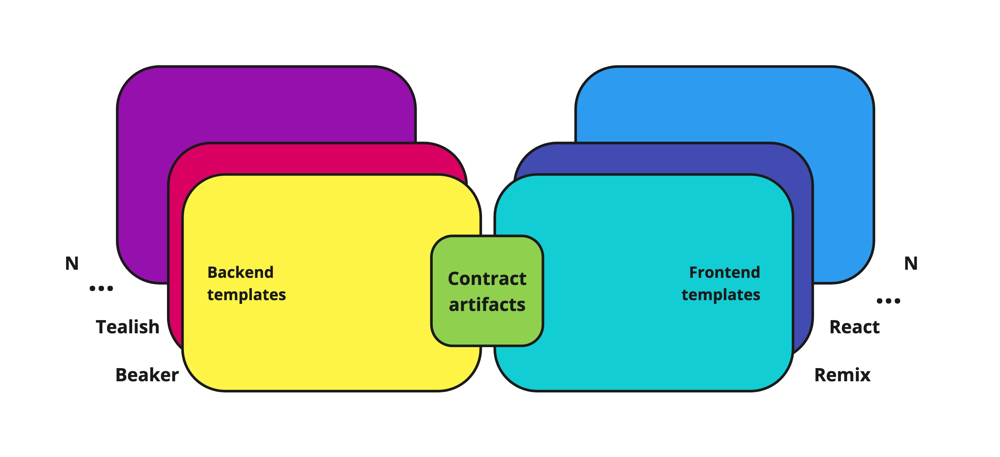
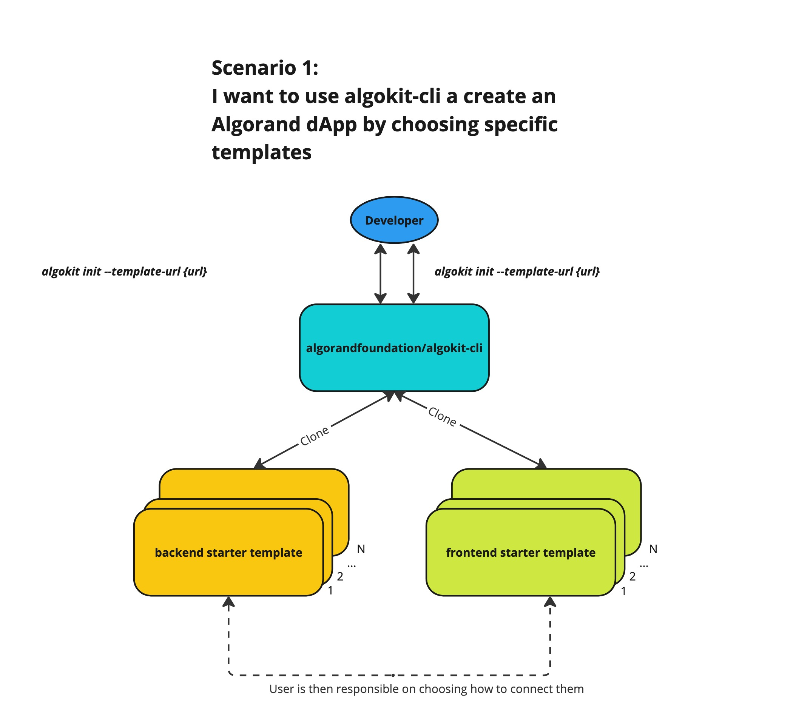
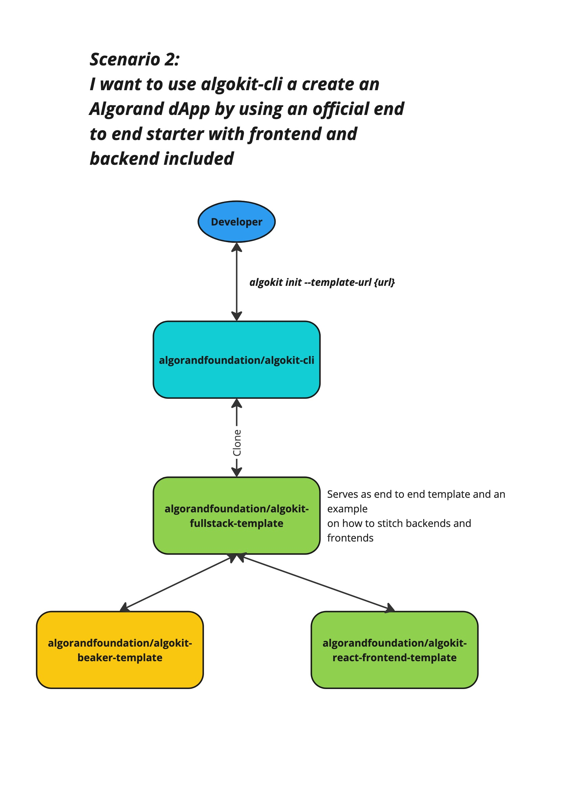

# Frontend Templates

- **Status**: Approved
- **Owner:** Altynbek Orumbayev
- **Deciders**: Rob Moore, Daniel McGregor, Adam Chidlow
- **Date created**: 2023-06-06
- **Date decided:** 2023-06-09
- **Date updated**: 2023-06-08

## Context

AlgoKit v2 aims provide an end-to-end development and deployment experience that includes support for the end-to-end smart contract and dApp development lifecycle. With the release of the typed clients feature - developers are now able to reduce the time it takes to fully integrate the interactions between the contract and the frontend components powering the end-to-end dapp user experience. Hence, as a logical continuation, the following Architecture Decision Record aims to expand on the current capabilities of AlgoKit to support the `frontend` templates, an [AlgoKit Principles](https://github.com/algorandfoundation/algokit-cli/blob/main/docs/algokit.md#guiding-principles) compliant approach towards simplifying integrations of smart contracts with the dApp frontend components.

## Requirements

### Independent Frontend Templates

1. Create official frontend template that complies with AlgoKit's principles of modularity, maintainability, and flexibility while also serving as a reference for template builders.

2. Expand algokit functionality to provide a clear process for developers to link frontend templates with the typed clients generated by backend templates.

3. Design frontend templates such that backend and frontend have no dependencies on each other, ensuring high modularity.

### End-to-End Starter Repositories

1. Establish a starter repository that allows developers to bootstrap end-to-end dApp projects within a single command, while also serving as an example for template builders on how to efficiently couple their backend and frontend templates.
2. Implement a bundling process for backend and frontend templates in the starter repositories that reduce code duplication and maintenance overhead.
3. Develop deployment pipelines for frontend components inside end-to-end starter repository that supports TestNet, and MainNet deployments to hosting providers of choice (Netlify, Vercel and etc to be decided).
4. Ensure that the end-to-end starter repository supports both manual deployment and deployment via a continuous deployment pipeline.

## Principles

- **Modularity**: The dApp templating feature should follow guiding AlgoKit principles and expand on approaches already utilized in existing smart contract templates feature. This implies that giving developers flexibility to mix and match different `smart contract` templates with `frontend` templates should serve as key consideration.
- **Maintainability**: The dApp templating feature should be easy to maintain and extend. This implies that the feature should be implemented in a way that allows for easy addition of new templates and/or modification of existing ones as the complexity and variety of templates scale.
- **Seamless onramp**: The dApp templating feature should provide a seamless onramp for developers to get started with dApp development. This implies that the feature should provide a simple and intuitive way to get started with dApp development and deployment. Providing developers a choice on whether they want more flexibility or rely on default recommended practices.

All of the aforementioned requirements should be met in a way that is consistent with the guiding principles of AlgoKit or attempt to find a balanced trade of between the principles that satisfies the requirements. Refer to [AlgoKit Guiding Principles](../../docs/algokit.md#Guiding-Principles) for detailed reference on the principles.

## Explored options

Enhancing AlgoKit's templating capabilities involves a notable shift from managing individual templates to co-locating multiple templates or projects together. This is a marked increase in complexity that requires careful consideration of the varying trade-offs between different approaches. The subsequent sections explore these options and their associated trade-offs, providing a concise overview of this new challenge and our proposed solutions.

### Option 1: Monolithic template

This option suggests that the frontend and backend templates should be bundled together in a single repository. This approach aims to simplify the maintenance of the templates by reducing the number of repositories that need to be maintained. Both official and community templates should be build on top of this approach where frontend is always tailored for specific needs of the smart contracts that are being used.

Drawbacks:

- **Lack of flexibility**: The monorepo approach does not allow developers to choose their preferred frontend technology stack. This is because the frontend is tightly coupled with the backend and the two cannot be separated. This is a major drawback as it limits the flexibility of the templates and does not allow developers to choose their preferred frontend technology stack.
- **Increased maintenance overhead**: Despite monorepos generally being easier to maintain and collaborate on, this approach has risks of increasing the maintenance overhead as it forces for code duplication when creating new template variations.

### Option 2: Separate individual frontend templates and official full-stack starter templates as an end-to-end reference

This option suggests that the frontend and backend templates should be maintained in separate repositories. This approach aims to provide developers with the flexibility to choose their preferred frontend technology stack. It also allows the templates to be maintained independently, thereby reducing the maintenance overhead.

Drawbacks:

- **Compatibility overhead**: The separate repositories approach increases the maintenance overhead as it requires the templates to be updated independently. This can lead to issues with compatibility between the templates and the typed clients.
- **Lack of guidance**: The separate repositories approach does not provide developers with a clear process for linking the frontend templates with the typed clients generated by the backend templates. This can lead to confusion and issues with the integration of the templates.

The outlined drawbacks can be mitigated by providing a clear process or reference for template builders on how to link various combinations of frontend and backend templates. The compatibility overhead can be mitigated by ensuring that backend and frontend modules are self sufficient and completely decoupled from each other. This will ensure that the templates can be updated independently. The implementation proposal below is a detailed exploration of this approach and ways to mitigate the drawbacks.

### Implementation proposal for Option 2

The proposal consists of 2 main parts. On a high level, the ideas revolve around giving developers a choice on how they want to couple AlgoKit backend and frontend templates if they like to use custom templates. The other is focused on providing an official full-stack template that bundles both backend and frontend templates together, while also serving as an example for template builders on how to efficiently couple any combination of templates.

The addendums to the proposal also explores orthogonal ideas that can further improve the CLI tooling itself by providing a way for any existing non web-3 frontend project be converted into a full-stack dApp with minimal efforts. Lastly, it expands on improving incentives for developers to build and maintain their own templates.

---

### Part 1. Independent frontend templates

> TLDR: Independent frontend templates will be created to provide developers with a highly customizable dApp starter project, built on AlgoKit's principles of modularity, maintainability, and flexibility. The templates will also serve as a reference for template builders.

The following aims to provide a seamless onramp for developers to get started with highly customizable dApp starter projects. The idea is to create a set of separate official frontend template repositories to serve as:
a) A reference for template builders on how to create standalone frontend templates that can be then further coupled with any backend template.
b) Expand on AlgoKit principles of modularity, maintainability and flexibility by giving developers a choice of preferred technological stack.

The official standalone frontend templates can be build by reusing already established best practices and templates from official backend repositories and by continuing reliance on `copier` for template automation. Another important consideration to keep in mind is that with the introduction of frontend templates we need to establish a clear separation of concerns between the backend and frontend templates to ensure modularity.

As demonstrated on the diagram above, the only glue connecting the backend and frontend is the generated typed client. Neither backend or frontend templates should be concerned with the other but instead provide modular interfaces that clearly indicate to developers on how to integrate the two. From a perspective of a backend template, the typed client shall be seen as a static asset that can be reused by any frontend template. Frontend templates on the other hand are mostly standard web projects with an additional layer of utilities that optionally allow them to be integrated with typed clients produced by backend templates.

#### Higher level overview

The main scenario to support for this part is to allow developers to use official starter templates to bootstrap end to end dApp projects.

As demonstrated above the dev experience will consist of executing an `algokit init` command for the preferred backends and frontends.

It gives user a choice and responsibility to then decide how to integrate the two components depending on their project needs. To improve this however, we should **additionally introduce a new utility** that will serve as a tool to automate linking with the typed client that backend templates will be generating. Implementation specific details can be discussed separately is it goes out of scope of this Architecture Decision Record.

---

### Part 2. End-to-end starter repositories

> TLDR: End-to-end starter repositories are designed to offer developers an official starter template for bootstrapping dApp projects. This is achieved by efficiently bundling backend and frontend templates to facilitate easy maintenance and smooth onboarding.

#### Higher level overview

The main scenario to support for this part is to allow developers to use official starter templates to bootstrap end to end dApp projects.

As demonstrated above the user experience will consist of a single execution of `algokit init` command pointed at official full-stack template repository. The full stack templates are responsible for bundling both backend and frontend templates together and providing a seamless onramp for developers to get started with dApp development. The way repositories are bundled should be easy to maintain and should not duplicate individual backend and frontend repositories to avoid redundant maintenance, instead it should expand on metatemplating capabilities of `copier` to allow for efficient reuse of existing standalone backend/frontend templates.

### Addendum 1. Converting _ANY_ frontend projects into dApps.

> TLDR: The approach aims to enhance the algokit-cli codebase's adaptability, enabling easy transformation of existing frontend projects into web3 dApps.

This orthogonal approach proposes to improve capabilities of the algokit-cli codebase by making it adaptable to various frontend stacks to allow anyone to easily convert their existing frontend projects into web3 dApps.

The implementation specific details will consist of deriving a set of bare minimum requirements for such feature to scan and understand the structure of frontend where algokit is being embedded and performing necessary modifications to project's files. A detailed discussion can be held in a scope separate from this Architecture Decision Record.

> This approach can be explored and maintained without overlapping with main proposal on frontend templates.

### Addendum 2. Website for choosing preferred frontend and backend repositories.

> TLDR: The approach proposes a website to enhance the discoverability of official and community-based algokit templates, thereby incentivizing template builders to create and maintain their own templates.

This orthogonal approach proposes to improve discoverability of official and community based algokit templates by providing a simple static website. The website can consist of minimalistic UI components for picking preferred backend, frontend and then a `Generate` button that will output copyable algokit CLI commands to spin up a project with the selected templates.

As a specific example, the website can be hosted on [AwesomeAlgo](https://awesomealgo.com) website, thus ensuring that this is an open-source community maintained entry-point for discovering and using algokit templates. Removing the need and maintenance overhead on our teams to maintain it as official resource.

Lastly, community template builders will get a platform to increase discoverability of their templates and further incentivize them to build and maintain them. While developers using the templates can support creators of templates by donating to their projects (a simple tipping mechanism for Algo and ASAs can be embedded into the website) or by contributing to the templates themselves.

> This approach can be explored and maintained without overlapping with main proposal on frontend templates.

---

## Final decision

After several review rounds team reached a conclusion to expand on [Option 2](#option-2-separate-individual-frontend-templates-and-official-full-stack-starter-templates-as-an-end-to-end-reference) and respective [implementation proposal](#implementation-proposal-for-option-2) given better alignment with AlgoKit design principles such as flexibility and modularity. Hence, the following proposal is further exploration of ideas based on this approach and propose solution to mitigate the potential drawbacks and risks outlined.

## Open questions

- Python typed clients are not going to be too relevant for scenarios where they need to be integrated with frontends given that in majority of cases a developer would prefer a TS typed client. Hence, how do we ensure that user gets a clear information and indication on when to use Python typed clients vs TS typed clients?
  - `Answer: This is a fair comment, but to my mind it's a clear dilineation in that it's dependant on what language you are using. While there are Python website libraries, we aren't using them we will use JavaScript (TypeScript).`
- Would we want to introduce a notion of non smart contract based backend templates that can be used to plug in the python typed clients and spin up servers that can be used to build APIs that interact with the smart contracts?
  - `Answer: This is definitely out of scope of dApp stuff.`

## Next steps

After the final decision is made, the action items necessary to implement the described proposal can be outlined as follows:

1. **Design and Development of Independent Frontend Template**: This involves selecting appropriate technology stacks and building out the templates. The template should be able to work with the generated typed client from the backend and will be used as a dependency for end-to-end starter repository.

2. **Development of End-to-End Starter Repository**: This involves building comprehensive template that bundles both frontend and backend components. The template should be designed to be easy to maintain and should leverage the metatemplating capabilities of `copier` for efficient reuse of existing standalone templates.

3. **Integration and Testing**: Ensure proper integration between frontend and backend templates. Also, extensive testing should be done to ensure smooth functioning and a seamless onramp experience for the developers.

4. **Documentation**: Write comprehensive documentation covering the use of the new templates, how to integrate them, and the utility for linking them with the typed client. This documentation should also include how-to guides and sample applications to help developers get started.

5. **Addendum 1 - Converting ANY Frontend Projects into dApps**: Start a separate discussion and potentially a project to research the feasibility of this idea. If feasible, design and implement a method that allows developers to convert their existing non-web3 frontend projects into dApps using AlgoKit.

6. **Addendum 2 - Development of Template Selection Website**: Plan and execute the development of a minimalist UI that allows developers to easily discover and select their preferred templates. This should also allow them to easily generate the necessary AlgoKit CLI commands for their project setup.

7. **Community Engagement**: Engage the developer community to drive contributions to the template repositories. This includes encouraging template builders to contribute and supporting developers using the templates with issues and suggestions.

8. **Continuous Review and Maintenance**: Regularly review the templates to ensure they are up to date with changes in technology and AlgoKit principles. Continuous maintenance should also be carried out to ensure the templates remain functional and relevant.

Regarding the open questions, these should be discussed in detail to clarify how to handle Python typed clients and the potential introduction of non-smart contract based backend templates. These discussions may lead to additional actions as required.
