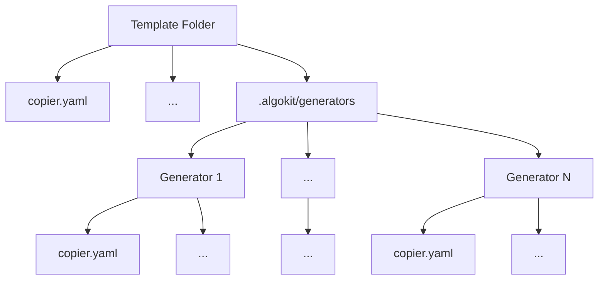

# Advanced `algokit generate` command

- **Status**: Approved
- **Owner:** Altynbek Orumbayev, Inaie Ignacio
- **Deciders**: Rob Moore, Daniel McGregor, Alessandro Cappellato
- **Date created**: 2023-07-19
- **Date decided:** 2023-07-24
- **Date updated**: 2023-07-24

## Context

The [Frontend Templates ADR](./2023-06-06_frontend-templates.md) introduced and expanded on AlgoKit's principles of Modularity and Maintainability by introducing a new set of official templates for quickly bootstrapping standalone `react` and `fullstack` projects showcasing best practices and patterns for building frontend and fullstack applications with Algorand. As a logical next step, we want to enable developers to extend existing projects instantiated from official templates with new files and features.

## Requirements

### 1. AlgoKit user should be able to use generate command to extend existing algokit compliant projects with new `files` of any kind

This implies scenarios like:

- Adding new contracts into existing algokit compliant projects.
  > Algokit compliant projects are projects that were instantiated from official or community templates and follow the same structure and conventions.
- Overriding existing files with new ones.
- Adding new files into existing projects.

Overall, we want to introduce a notion of `generators` which can be viewed as a modular self-sufficient template units that are hosted within template repositories and describe how to create or update files within projects instantiated from AlgoKit templates.

Ruby on Rails has a similar concept of [generators](https://guides.rubyonrails.org/generators.html) which are used to create or update files within Rails projects. This can be used as a reference for inspiration.

### 2. Template builder should be able to access a clear guideline and refer to official templates for examples on how to create `generators`

This implies extension of existing starter guidelines available for template builders on [AlgoKit Docs](https://github.com/algorandfoundation/algokit-cli/blob/main/docs/tutorials/algokit-template.md) and using one or several official templates as a reference point.

## Principles

- **Modularity**: Artifacts dependant on `advanced algokit generate` command capabilities embedded into templates should follow guiding AlgoKit principles and expand on approaches already utilized in `react`, `fullstack` and `beaker` templates. This implies that giving developers flexibility to define any extra templating logic, allowing to create or update any files within projects instantiated from algokit templates.
- **Maintainability**: The `advanced algokit generate` capabilities on `algokit-cli` and related artifacts on respective official templates should be easy to maintain and extend.
- **Seamless onramp**: Great developer experience for template builders to create their own `generators` and user experience to use them via `advanced algokit generate` command should be a priority.

All of the aforementioned requirements should be met in a way that is consistent with the guiding principles of AlgoKit or attempt to find a balanced trade of between the principles that satisfies the requirements. Refer to [AlgoKit Guiding Principles](../../docs/algokit.md#Guiding-Principles) for detailed reference on the principles.

## Considered Options

Based on preliminary research, all of the options below assume that:
A `generator` is a self contained copier/jinja template that is hosted within a template repository and describes how to create or update files within projects instantiated from algokit templates. Hosting it along with the template is a necessity given that community based templates can follow different conventions, patterns and structure making it hard to attempt to generalize the logic of `generators` and make them work for all templates.

### Option 1: Wrapping generators into self contained copier templates hidden within algokit templates

This option implies that `generators` are self contained copier templates that are hidden within algokit templates and are not exposed to the end user. This option is inspired by [Ruby on Rails generators](https://guides.rubyonrails.org/generators.html) and [Yeoman generators](https://yeoman.io/authoring/).

The main idea is to rely on `_templates_suffix` in copier.yamls to define 2 separate types of suffixes for `templates` and for `generators`:

- Existing templates under all official algokit templates are already prefixed with `.jinja` hence we just need to explicitly prefix it with `.jinja` on root copier
- The new generators jinja templates can be prefixed (for example) with alternative file extension for jinja files such as `.j2`. Which is also a common convention for jinja templates.
- - This only works for files though for regular folders and cases like `folder_name.j2` we need to wrap them into  to that first pass when template initially initialized unwraps the content allowing second pass via generator to then use them as jinja templates. The only downside here is slightly longer file names for folders, but I think it's a reasonable tradeoff considering simplicity of the solution.

Overview of the proposal can be summarized via the following diagram:



#### Pros

- Generators are hidden within algokit templates and are not exposed to the end user. When user runs `algokit generate` command, cli presents a list of available generators to choose from. This makes it easier for user to understand what generators are available and what they do.
- Generators are self contained copier templates giving template builders flexibility to do any kind of templating logic similar to what they can already do with regular templates.
- Majority of implementation complexity is reduced by relying on copier as a backbone for generators feature.

#### Cons

- Generators are somewhat tightly coupled with individual algokit templates, which implies its not necessarily a matter of copy pasting generators from one template to another. This can be a problem for community template builders who want to reuse generators from official templates. However, this can be mitigated by providing clear guidelines on how to create generators and referring to official templates as a reference point. Additionally, it seems like a reasonable tradeoff given that templates can vastly differ in type, structure, conventions and patterns and it's significantly harder to generalize the logic of generators to make them work for all templates.

#### Implementation details

**1. Adjusting templates structure**

For instance, if we assume existing `beaker` template, the new file/folder structure can look as follows:

```
template_content/.algokit # alternatively could be just `.algokit-generators`
└── generators
    └── {generator_name} # generator name can be anything
        ├── copier.yaml # copier config for generator
        └── smart_contracts # logic for adding new contracts to beaker template
            └── {{ contract_name }}
                ├── contract.py.j2
                ├── deploy_config.py.j2
                └── deploy-config.ts.j2
...rest of the template is left as is
copier.yml
```

The `index.ts` and `config.py` files on beaker template need to be updated to auto import all contracts from sub folders at `smart_contracts` to eliminate the need for developers to manually import them after running the smart contract generator.

> Please note, above is just an example that assumes the generator for adding new contracts, but the proposal is generic enough to support any kind of jinja-based templating logic.

**2. Adjusting `.algokit.toml`**

The proposal for new structure for defining generators in root algokit toml is as follows:

```toml
[generators.create_contract] # [generators.<generator_name>]
description = "Adds new smart contract to existing project" # description of the generator, can appear in cli for extra info
path = ".algokit/generators/create_contract"  # path that cli should grab to forward to copier copy
```

**3. Adjusting `algokit generate` command on cli**

Next step in implementation part of the proposal is adjusting the `generator` command on `algokit-cli` to make sure it knows how to look for generators. The available generators can be provided to user via list picker (a.k.a ruby on rails style) by letting algokit scan contents of `algokit.toml` and look for `.generators` folder.

a) Has no generators
If algokit-cli can't find any generator configured then nothing change from current implementation.

b) Has generators and user runs `algokit generate` command to see the list of available generators
A new `click` command per each generator in `.algokit.toml` is added to the list of generate commands, that will list all available generators for the user to choose from.

```bash
algokit-cli generate

---

Usage: algokit generate [OPTIONS] COMMAND [ARGS]...

  Generate code for an Algorand project.

Options:
  -h, --help  Show this message and exit.

Commands:
  client  Create a typed ApplicationClient from an ARC-32 application.json
  smart-contract  Adds new smart contract to existing project
```

Then, to invoke the interactive flow via copier user runs:

```bash
algokit-cli generate smart-contract `name of the contract`
```

c) Has generators, user knows what to pick and wants to run it non interactively
Using the generator configuration the `generator` will automatically add new `click` commands to the existing list of generate commands allowing the user to run them in the command line.

```bash
algokit-cli generate smart-contract -a contract_name=`name of the contract` -a language=python # passing extra arguments to generator similar to algokit init
```

**4. Testing and documentation**

Lastly we need to make sure that the new feature is properly tested and documented. This includes:

- Testing the new feature works as expected on all official templates that will host generators. This will imply adding a separate test suite that picks some default template state and run generators on top of them confirming that created artifacts are placed in expected locations and have expected content. Tests should be easy to follow and expand on existing tests suite on templates without introducing extra complexity.
- Introduce new tutorial sections on [AlgoKit Docs](https://github.com/algorandfoundation/algokit-cli/blob/main/docs/tutorials/algokit-template.md) on how to create generators and refer to official templates as a reference point.

### Option 2: Wrapping generators into self contained copier templates hosted on separate repositories

This option proposes to host `generators` on separate set of repositories and use them as a dependency for algokit templates.
`algokit.toml` can be extended on template repositories to list generators they depend on.

The only distinction between this option and option 1 is that generators are hosted on separate repositories and are not hidden within algokit templates. Implying that they are not tightly coupled with algokit templates and can be reused/forked by community template builders to build their own generators.

#### Pros

- Generators are not tightly coupled with algokit templates and can be reused/forked by community template builders to build their own generators.
- Generators can be versioned and updated independently from algokit templates.

#### Cons

- Developing and maintaining generators is significantly more complex due to the need to maintain separate repositories and versioning.
- Official maintainers and community template builders need to be put extra effort at keeping generators generic enough to be reused by other templates. Given that templates can vastly differ in type, structure, conventions and patterns, this can be a challenge.
- Given that copier is being considered as a backbone for generators feature, drawbacks outlined for hosting templates on monorepos in the [previous adr](2023-06-06_frontend-templates.md#option-1-monolithic-template) apply here as well.

## Open questions for reviewers

1. What kinds of generators other than `add new contract` do we want to support on initial release (if any)?
2. Are there any other template repositories that we want to integrate with generators other than `beaker` (`fullstack` will contain those as well as it uses `beaker` as a dependency)?

> Please note an MVP PoC is already implemented and available to play around on algokit-cli and beaker template repo under `advanced-generate-command` and `generators` branches respectively.
> To test it out checkout the branche on cli do `pipx install . --force`, navigate to beaker template repo and checkout the branch as well, then navigate to any of the sub folders in `tests_generated`. Lastly do `algokit bootstrap all`, build the contract and execute `algokit generate` from root of that folder to play around with the feature based on the implementation proposal from Option 1.

## Final Decision

The team approved the proposal for Option 1: Wrapping generators into self contained copier templates hidden within algokit templates.

## Next steps

1. Polishing the PoC on algokit-cli and adding tests
2. Polishing the PoC on beaker template and adding tests
3. Adding documentation for new capabilities of the generate command
4. Adding documentation for template builders on how to create generators
