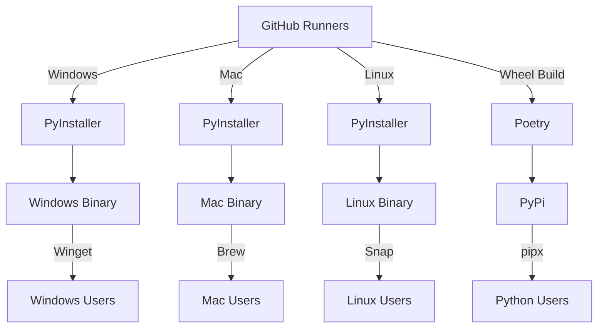

# AlgoKit CLI Enhancements

- **Status**: Draft
- **Owner:** Altynbek Orumbayev (MakerX), Negar Abbasi (MakerX)
- **Deciders**: Algorand Foundation, Rob Moore (MakerX), ... to be adjusted
- **Date created**: 2024-01-13
- **Date decided:** TBD
- **Date updated**: 2024-01-16

## Context

The primary motivation for this decision is to streamline the installation process of AlgoKit CLI and reduce the friction associated with installing it on various operating systems. Currently, users often encounter minor environment-specific bugs during installation, which can be a significant deterrent. By providing native binaries, we aim to speed up the installation time and eliminate these bugs, thereby improving the overall user experience.

The north star for this decision is to provide a distribution model that can be described as:

> Note that PyPi in the diagram above represents the existing distribution model for AlgoKit CLI prone to environment-specific bugs.

The scope of this ADR only concerns the packaging for the CLI. The distribution via `snap`, `winget` and etc will be handled separately/in-parallel after decision and implementation of this ADR is in place.

## Requirements

- The native binaries should be easy to maintain and understand from a CI/CD deployment perspective.
- The solution should support a wide variety of Linux distributions, macOS (both Apple Silicon and Intel architectures), and Windows.
- The solution should integrate seamlessly with existing installation options, including Homebrew, or provide an easier alternative.
- The solution should be designed with future scalability in mind, allowing for the addition of support for other variations of architectures or else as needed.
- The solution should not significantly increase the complexity of the build process.
- The solution should provide clear error messages and debugging information to assist in troubleshooting any issues that may arise.

## Options

### Option 1 - PyInstaller

**Pros**

- Easy to use and configure
- Supports multiple platforms and architectures
- Can handle complex packages and dependencies
- Generates a single file executable
- Active development and community support
- Fairly fast build time via ci - ~3-4 minutes
- Fairly small executable size - sub 20MB

**Cons**

- Larger executable files compared to cx_Freeze
- Occasionally requires manual configuration for more complex packages
- Not as customizable as cx_Freeze
- Load time is long = 5-10 sec but only when bundled in one-file. When distributed in unpacked state it is sub 1-2 seconds.
- Requires complex build packaging matrix to support multiple platforms and architectures

#### PoC

The PoC is available [here](https://github.com/algorandfoundation/algokit-cli/pull/382). It outlines a simple github action with extra setup that compiles algokit cli as a single file executable on latest versions of Windows, Mac and Linux github runners.

Testing the PoC against compiled executables revealed the following issues that would need to be addressed on the CLI side in parallel with actioning on this ADR:

1. algokit task vanity-address - fails to use multiprocessing when bundled in one-file and requires extra setup to use multiprocessing
2. algokit init fullstack template failing during inject.py execution. This is due to the fact that both cli and python when bundled together are invoked from the same directory and inject.py is not able to find python executable. Requires fixes on the CLI side.

### Option 2 - Nuitka

**Pros**

- Nuitka translates Python code into C and then compiles it, which can result in performance improvements.
- Cross-Platform: Supports multiple platforms including Windows, macOS, and Linux.
- Official github action simplifies the process of building executables for different platforms.

**Cons**

- Compilation Time: The process of converting Python to C and then compiling can be time-consuming. Up to ~30 minutes on github with 3 parallel jobs.
- Size of Executable: The resulting executables can be larger due to the inclusion of the Python interpreter and the compiled C code. Sub 70MB.
- Limited Support: Nuitka does not support Python 3.12.
- Cross compilation options but still requires something like ManyLinux docker image for building and capturing oldest versions of linux distros to maximize compatibility

#### PoC

The PoC is available [here](https://github.com/algorandfoundation/algokit-cli/pull/393). It outlines a simple github action with extra setup that compiles algokit cli as a single file executable on latest versions of Windows, Mac and Linux github runners.

Testing the PoC against compiled executables revealed the following issues that would need to be addressed on the CLI side in parallel with actioning on this ADR:

1. algokit doctor - fails to access python via `sys.executable` and `sys.path` when bundled in one-file
2. algokit task vanity-address - fails to use multiprocessing when bundled in one-file and requires extra setup to use multiprocessing
3. boot time is slow when bundled in one-file, ~5 seconds and up to ~10 seconds on Windows. Windows is the slowest to boot up and is adviced to be distributed in unpacked state instead of single executable file.
4. algokit init fullstack template failing during inject.py execution. This is due to the fact that both cli and python when bundled together are invoked from the same directory and inject.py is not able to find python executable. Requires fixes on the CLI side.

### Option 3 - Cross platform python wheels with `cibuildwheel`

**Pros**

- cibuildwheel is a versatile tool that simplifies the process of building wheels for different platforms and Python versions.
- It supports a wide range of Python versions and platforms, including Windows, macOS, and Linux.
- It integrates well with CI/CD systems, making it easy to automate the wheel building process.
- It can handle complex dependencies and package structures.
- It provides a consistent and reproducible build environment, which can help reduce environment-specific bugs.
- Minimal configuration is required to get started and aligns with existing distribution methods like PyPi.

**Cons**

- As it doesn't produce standalone executables, the end users still need to have Python installed on their systems.
- The wheels produced might not be as portable as standalone executables, as they can still be affected by the specific Python environment on the user's machine.
- It doesn't inherently support distribution methods like Homebrew or Winget, additional work might be needed to integrate with these systems.

There is no PoC supporting this option given an official github action by `pypa` that is a plug and play solution for building wheels for different platforms and python versions.

### Honorable Mentions

#### cx_Freeze

cx_Freeze is a set of scripts and modules for freezing Python scripts into executables. It is similar to PyInstaller in many ways, but PyInstaller is preferred due to its more mature and comprehensive documentation.

#### PyOxidizer

PyOxidizer is a utility for producing binaries that embed Python. However, it is no longer actively maintained, which makes it a less desirable option for our needs.

## Preferred option

Based on observations so far we are leaning towards a combination of Option 1 and 3. Where we would use PyInstaller to build native binaries for Windows, Mac and Linux and use cibuildwheel to build native wheels for different platforms and python versions with frozen dependencies which can aid a bit with issues around pipx not respecting the lockfiles.

## Selected option

{Which option did we select and why (can sometimes be different from the preferred option)}

## Next Steps
