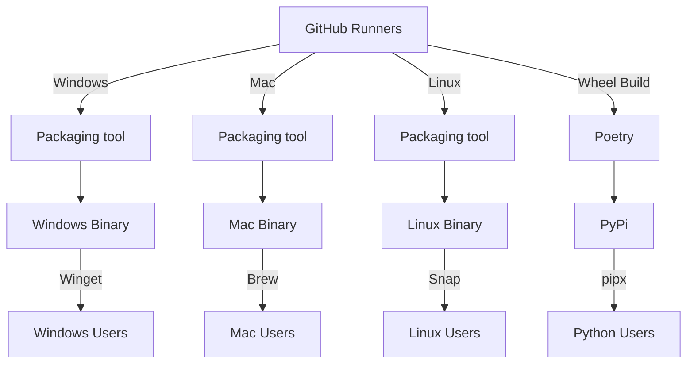
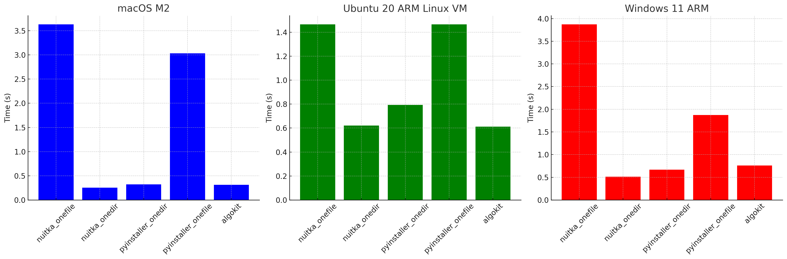
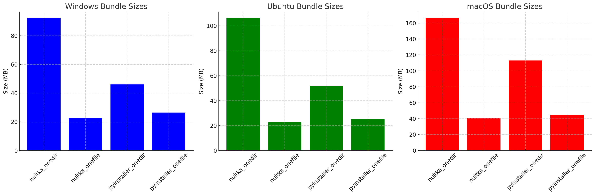

# AlgoKit CLI native binaries

- **Status**: Approved
- **Owner:** Altynbek Orumbayev (MakerX), Negar Abbasi (MakerX)
- **Deciders**: Alessandro (Algorand Foundation), MakerX
- **Date created**: 2024-01-13
- **Date decided:** 2024-01-25
- **Date updated**: 2024-01-16

## Context

The primary motivation for this decision is to streamline the installation process of AlgoKit CLI and reduce the friction associated with installing it on various operating systems. Currently, users often encounter minor environment-specific bugs during installation, which can be a significant deterrent. By providing native binaries, we aim to speed up the installation time and eliminate these bugs by **removing requirements to install python by the user**, thereby improving the overall user experience.

The north star for this decision is to provide a distribution model that can be described as:

> ⚠️⚠️⚠️ Please note diagram above is a draft and is to be separately discussed in a follow up ADR that will focus on distribution of the binaries.

The scope of this ADR only concerns the packaging for the CLI. The distribution via `snap`, `winget` and etc will be handled separately/in-parallel after decision and implementation of this ADR is in place.

## Requirements

- The native binaries should be easy to maintain and understand from a CI/CD deployment perspective.
- The solution should support a wide variety of Linux distributions, macOS (both Apple Silicon and Intel architectures), and Windows.
- The solution should integrate seamlessly with existing installation options, including Homebrew, or provide an easier alternative.
- The solution should be designed with future scalability in mind, allowing for the addition of support for other variations of architectures or else as needed.
- The solution should not significantly increase the complexity of the build process.
- The solution should provide clear error messages and debugging information to assist in troubleshooting any issues that may arise.
- You don't need to install Python on your system to use AlgoKit if you aren't creating a Python project.

## Options

### Option 1 - PyInstaller

**Pros**

- Easy to use and configure
- Supports multiple platforms and architectures
- Can handle complex packages and dependencies
- Generates a single file executable
- Active development and community support
- Fairly fast build time via ci - ~3-4 minutes
- Fairly small executable size (see benchmarking results below)
- Marginally equal executable load time in `onedir` mode compared to `onefile` mode

**Cons**

- Occasionally requires manual configuration for more complex packages
- Requires complex build packaging matrix to support multiple platforms and architectures
- Requires minor tweaks in algokit cli to account for the fact that features relying on `sys.executable` will point to algokit cli executable instead of python interpreter. This is a minor change and can be done in a backwards compatible way however still a con to consider.
- Requires minor tweaks in algokit cli to introduce `multiprocessing.freeze_support()` to avoid issues with `vanity-address` task when executing via binary.

#### PoC

The PoC is available [here](https://github.com/algorandfoundation/algokit-cli/pull/382). It outlines a simple github action with extra setup that compiles algokit cli as a single file executable on latest versions of Windows, Mac and Linux github runners.

### Option 2 - Nuitka

**Pros**

- Nuitka translates Python code into C and then compiles it, which can result in performance improvements.
- Cross-Platform: Supports multiple platforms including Windows, macOS, and Linux.
- More cross compilations options than PyInstaller
- Official github action simplifies the process of building executables for different platforms.

**Cons**

- Compilation Time: The process of converting Python to C and then compiling can be time-consuming. Up to ~30 minutes on github with 3 parallel jobs.
- Size of Executable: The resulting executables can be larger due to the inclusion of the Python interpreter and the compiled C code (see benchmarking results below).
- Does not support Python 3.12.
- Requires minor tweaks in algokit cli to account for the fact that features relying on `sys.executable` will point to algokit cli executable instead of python interpreter. This is a minor change and can be done in a backwards compatible way however still a con to consider.
- Requires minor tweaks in algokit cli to introduce `multiprocessing.freeze_support()` to avoid issues with `vanity-address` task when executing via binary.

#### PoC

The PoC is available [here](https://github.com/algorandfoundation/algokit-cli/pull/393). It outlines a simple github action with extra setup that compiles algokit cli as a single file executable on latest versions of Windows, Mac and Linux github runners.

### Benchmarking `pyinstaller` vs `nuitka` vs pipx installed `algokit`

#### Methodology

`hyperfine` was used to benchmark 5 different executables:

- Nuitka Onefile - Nuitka compiled executable with `--onefile` flag, which produces a single file executable.
- Nuitka Onedir - Nuitka compiled executable with `--onedir` flag, which produces a directory with the executable and other dependencies unzipped.
- PyInstaller Onedir - PyInstaller compiled executable with `--standalone` flag, which produces a directory with the executable and other dependencies unzipped.
- PyInstaller Onefile - PyInstaller compiled executable with `--onefile` flag, which produces a single file executable.
- AlgoKit from `pipx` - AlgoKit CLI installed via `pipx` with all dependencies frozen (current latest stable release).

The benchmarking was performed on a MacBook M2 running macOS 14.2.1 and an ARM based Ubuntu 20.04.3 LTS running on a Parallels Desktop on the same machine.

#### Results

| Method              | macOS M2 | Ubuntu 20 ARM Linux VM | Windows 11 ARM |
| ------------------- | -------- | ---------------------- | -------------- |
| nuitka_onefile      | 3.634    | 1.465                  | 3.874          |
| nuitka_onedir       | 0.2515   | 0.6200                 | 0.5136         |
| pyinstaller_onedir  | 0.3228   | 0.7927                 | 0.6668         |
| pyinstaller_onefile | 3.031    | 1.466                  | 1.875          |
| algokit             | 0.3126   | 0.6111                 | 0.7579         |

_Figure: Benchmarking results comparing the performance of Nuitka (onefile, onedir modes), PyInstaller (onefile, onedir modes), and pipx installed Algokit CLI on macOS M2, Windows 11 ARM VM, Ubuntu 20 ARM VM._

| Method              | Windows (MB) | Ubuntu (MB) | macOS (MB) |
| ------------------- | ------------ | ----------- | ---------- |
| nuitka_onedir       | 92.10        | 106         | 166        |
| nuitka_onefile      | 22.48        | 23          | 41         |
| pyinstaller_onedir  | 46.07        | 52          | 113        |
| pyinstaller_onefile | 26.47        | 25          | 45         |

_Figure: Bundle sizes of folders with executables build with Nuitka (onefile, onedir modes), PyInstaller (onefile, onedir modes)._

#### Preliminary Observations

- Nuitka's warmed up execution time is **fast**
- Nuitka produces largest executables in `onedir` mode
- Nuitka is the slowest to build (no charts for build benchmarks, this is observations based on CI build time from PoC, see links above)
- PyInstaller produces smallest executables in `onedir` mode
- PyInstaller is the fastest to build (no charts for build benchmarks, this is observations based on CI build time from PoC, see links above)

### Honorable Mentions

#### cx_Freeze

cx_Freeze is a set of scripts and modules for freezing Python scripts into executables. It is similar to PyInstaller in many ways, but PyInstaller is preferred due to its more mature and comprehensive documentation.

#### PyOxidizer

PyOxidizer is a utility for producing binaries that embed Python. However, it is no longer actively maintained, which makes it a less desirable option for our needs.

## Preferred option

Based on observations so far we are leaning towards an Option 1. Where we would use PyInstaller to build native binaries for Windows, Mac and Linux.

While `nuitka` in `onedir` mode is even faster than pip installed algokit, it generates larger executables, and is the slowest option in terms of build time. Pyinstaller is only marginally slower than `nuitka` or pip installed algokit in terms of execution time, has mature documentation, and is the fastest option to build (in `onedir` mode) and produces smaller executables than `nuitka`. Given that and the fact that `nuitka` does not support Python 3.12 yet and has a lot of `magical` optimizations hidden under the hood, we are leaning towards PyInstaller as the preferred option for building native binaries given its maturity and straightforwardness despite marginally slower execution time (which is not a big deal given that we are talking of deviations of 5-10 milliseconds).

## Selected option

The team has formally pre-discussed this ADR and has agreed to proceed with Option 1 - PyInstaller.

## Next Steps

- [ ] Finalize the decision on the preferred option.
- [ ] Expand PoC and polish the github action to build native binaries for Windows, Mac and Linux for x86, x86-64 and ARM architectures.
- [ ] Implement portability snapshot tests, expanding existing algokit cli snapshot tests by running against real executable covering main functionality to test and ensure that the native binaries are portable and behave the same way as pip installed algokit cli.
- [ ] Submit follow up ADR to discuss strategies on how to distribute the binaries in most accessible, user friendly and secure way.
