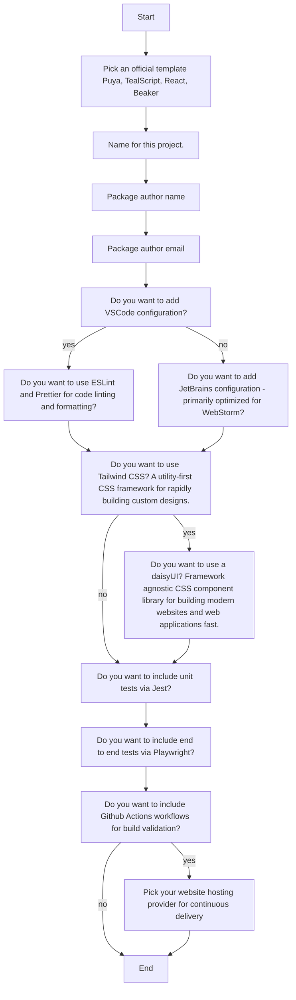
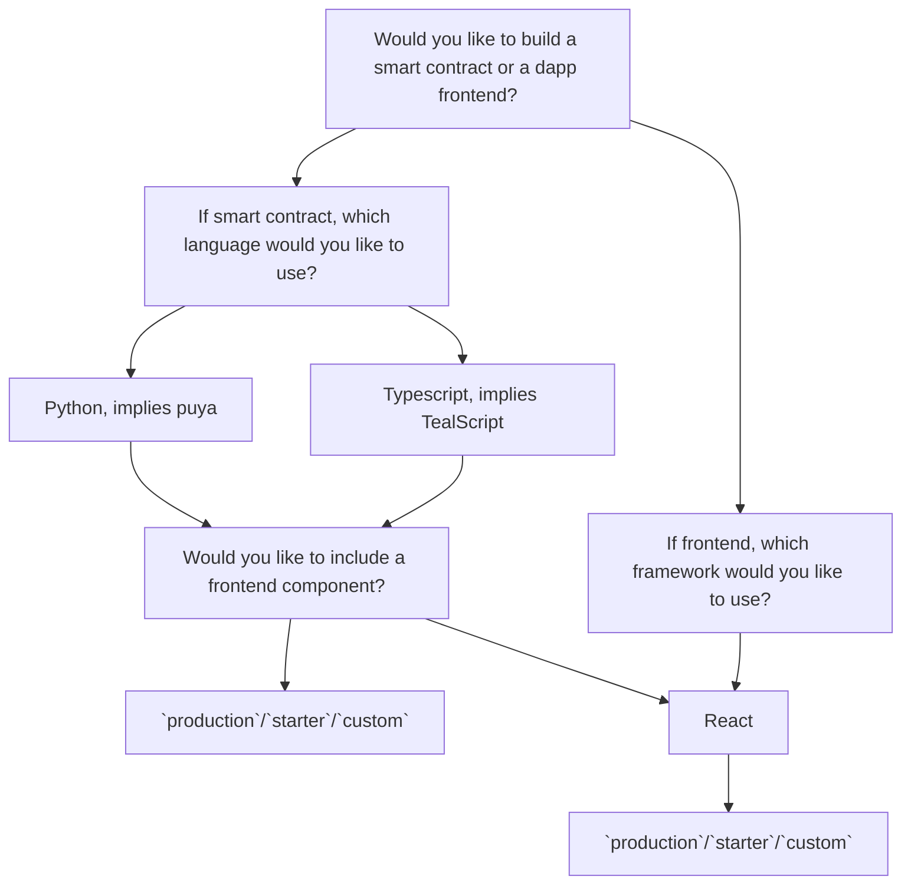

# AlgoKit Init Wizard Version 2 and Template Enhancements

- **Status:** Proposed (Revision 2)
- **Owner:** Altynbek Orumbayev
- **Deciders:** Alessandro (Algorand Foundation), Rob Moore (MakerX), MakerX team
- **Creation Date:** 2024-01-23
- **Decision Date:** 2024-02-13
- **Update Date:** 2024-02-12

## Revisions

- **Revision 1:** Initial discussions with Alessandro, Michael, Joe, Georgio, and Chris identified key issues with the existing wizards and explored ways to improve templating capabilities. These discussions led to the consideration of a unified 'monorepo' structure to consolidate template repositories into more focused, smaller generators under a single repository. The revision also sought to refine the wizard and enhance command orchestration capabilities, incorporating tools like `npm workspaces`.
- **Revision 2:** Engaged in multiple brainstorming sessions with Algorand Foundation/DevRel members and MakerX engineers to develop a pragmatic, time-bound, and prerequisite-neutral strategy. This approach resulted in splitting the ADR into two segments: one focusing on the `init` wizard enhancements and the other on template improvements and command orchestration upgrades in algokit-cli.

## Background

This ADR emerges from various discussions aimed at enhancing the `init` wizard version 2 user experience and aligning it with emerging smart contract languages/frameworks to make it more user-friendly and accessible to beginners. It builds upon prior decisions from the [Advanced algokit generate command](./2023-07-19_advanced_generate_command.md) and [Frontend Templates](./2023-06-06_frontend-templates.md) ADRs, integrating feedback from the Algorand Foundation and DevRel team.

### Main Areas for Improvement

1. **Enhancements to the `Init` Wizard:**

   - Improve user experience by making the wizard more intuitive and less reliant on Algorand-specific jargon.
   - Streamline the `presets` concept to minimize user inputs and simplify the process.

2. **Template Refinements:**

   - Address potential complexities in maintaining the `fullstack` template with new `smart-contract` template combinations, including future `.NET` integration alongside `puya` compiler-compatible stacks.
   - Implement `codespaces` configurations for simplified project setup in GitHub Codespaces.
   - Consider unifying `add smart contract` generators in the `puya` and `beaker` templates into a single, generic generator managed by the CLI itself (suggestion added as part of revision 2 based on DevRel feedback). This helps solving the problem of simplifying template building experience (removing duplication of generators that are essentially generic) while still giving an option for template builders to have custom generators within templates.

3. **CLI Enhancements:**

   - Enhance user experience by standardizing the use of `bootstrap`, `algokit.toml`, `.algokit` folder, and `.env` conventions, presenting a unified and intuitive CLI interface.

## Detailed Proposals

### 1. Improved `Init` Wizard Flow

Shift from a detailed, template-specific question format to a more streamlined, interactive process that focuses on the user's intent rather than specific technologies within the Algorand ecosystem.

**Current Init Wizard V1:**



**Proposed Init Wizard V2:**



The proposal aims to simplify the question process and reduce the overall number of questions, focusing on identifying **what** the user intends to build without the additional complexity of selecting specific Algorand ecosystem tools or languages.

As illustrated in the proposed flow diagram, the initiative seeks to:

- Simplify the init wizard's questions, avoiding technical jargon and aligning with popular programming languages and frameworks, leveraging direct mappings like `python`, `typescript`, and `.net`.
- Introduce clear preset options: `starter` for a comprehensive preselection based on the Algorand Foundation's recommendations, `production` for setups aligned with production standards, and `custom` for developers seeking detailed customization through template questions.

This proposal presents no significant drawbacks, as it refines the question flow of the algokit init process without altering the command's fundamental behavior, thereby not impacting current users and enhancing the overall `init wizard` experience.

### 2. Fullstack Template and CLI Command Orchestration Enhancements

This dual-step approach suggests offloading business logic related to linking smart contracts and frontends within fullstack to a self-contained generator within the `react` template. It also introduces the concept of command orchestration in algokit-cli to manage project lifecycles more effectively.

#### 2.1 Autonomy of Frontend Template

**Fullstack Template Structure**:

| Before                                                                                                                                                                                                                                                     | After                                                                                                                                                                                                                                                                         |
| ---------------------------------------------------------------------------------------------------------------------------------------------------------------------------------------------------------------------------------------------------------- | ----------------------------------------------------------------------------------------------------------------------------------------------------------------------------------------------------------------------------------------------------------------------------- |
| The current fullstack is tightly coupled with the frontend template, handling the connection between frontend and backend. This coupling necessitates additional safety checks whenever there are changes in the expected structure of the React template. | The frontend now invokes the `import-contract` generator within the React template, which autonomously manages the linkage with a smart contract project. This adjustment makes the fullstack less reliant on template-specific changes that it should not be concerned with. |

The proposal includes changes to the fullstack template's structure, enabling the frontend to autonomously manage its linkage with smart contract projects, thereby simplifying integration and enhancing maintainability.

**Benefits:**

- Simplifies integration of templates by allowing the frontend template to manage smart contract linkages independently.
- Generalizes the fullstack template, offering flexibility in choosing backend components.

**Suggested Enhancements:**

- Further generalize the `AppCalls.tsx` component, removing assumptions on default `hello world` contracts and using `resolveBy: 'id'` by default.
- Incorporate suggestions from discussions during revision 2, including the potential bundling of `add smart contract` generators directly into `algokit-cli` for reduced redundancy and enhanced template support.

#### 2.2 CLI Command Orchestration

Aims to utilize `algokit.toml` for organizing project-specific commands, enhancing project management and command execution through a more structured approach.

Example workspace root `.algokit.toml`:

```toml
[algokit]
min_version = "v1.8.0"

[project]
type = 'workspace' # informs algokit-cli that this is a workspace root that hosts multiple projects
name = 'myworkspace' # included for reference but unique identifier for the workspace can be actually be excluded as it is not required for orchestration to work
projects = ['src'] # a list of relative/absolute paths directly to folders with independent components of the project that are part of the workspace or roots of folders hosting multiple independent components
```

Example workspace of a smart contract project `.algokit.toml`:

```toml
[algokit]
min_version = "v1.8.0"

[generate.smart_contract]
description = "Adds new smart contract to existing project"
path = ".algokit/generators/create_contract"

[project]
type = 'backend'
name = '{ component_name }'

# The `deploy` command is categorized separately due to its static nature. Category names align with their root command group, hence `generate` is under [generate], while `deploy` is categorized under [project].
[project.deploy]
command = "poetry run python -m smart_contracts deploy"
environment_secrets = [
  "DEPLOYER_MNEMONIC",
]

[project.deploy.localnet]
environment_secrets = []

# New category for project specific commands that can be defined arbitrarily by the user
[project.commands]
test = { command = "poetry run pytest", description = "Run unit tests for the smart contracts" }
build = { command = "poetry run python -m smart_contracts build", description = "Transpile puya smart contracts into TEAL and ABI specs" }
# Description is used as `help` text as content gets presented to user via `algokit cli` interface.
```

**Enhancements to `.algokit.toml` enable the cli to:**

- Navigate and interpret any project structure compliant with `.algokit.toml`.
- Simplify interactions with project-specific commands.
- Dynamically orchestrate command execution based on `.algokit.toml` configurations.
  - For `algokit project {command_name}` executed at the workspace root, it aggregates and executes `{command_name}` from all child components either `sequentially` or `concurrently`, allowing users to choose the execution order per matching command identifier.
  - When executed at a component's root, it runs the component-specific command from its `.algokit.toml`, also integrating it into the `algokit project` command group for visibility.

**Suggested Improvements:**

- Consider introducing command dependencies to ensure execution order for any command (in addition to current proposal to allow handling execution order for commands with matching 'names/identifiers'), enhancing the orchestration capabilities of the CLI.

## Reference: Alternatives Considered

### Consolidating AlgoKit Templates into a Monorepo

**Overview:** Explores the possibility of merging AlgoKit templates into a single repository, focusing on streamlined project management and orchestration within js-centric environments.

**Pros:**

- Simplifies monorepo project management and orchestration in npm-based projects.

**Cons:**

- Increases complexity and potential conflicts with existing CLI capabilities and Copier's recommendations, suggesting that a better alternative might be to consider a shift to where we have a more CLI-centric approach that handles orchestration without introducing extra dependant pre-requisites.

## Decision

A phased implementation of both proposals, starting with user-facing enhancements to the `init` wizard followed by template and CLI command orchestration improvements. This strategy allows for immediate impact and addresses urgent needs first, with potential for further simplification through subsequent enhancements.

## Next Steps

1. Break down the selected options into detailed work items.
2. Implement the proposed changes in the AlgoKit CLI and templates.
3. Update documentation and onboarding materials to reflect the new changes.
4. Announce the updates to the community and DevRel, soliciting feedback for future enhancements.
5. Tackle minor improvements that become feasible following the main proposal implementations.

### Open Questions

1. Should we implement a bidirectional query mechanism where selecting a smart contract prompts the option to add a frontend, and similarly, choosing a frontend first triggers a query about integrating a smart contract? This approach necessitates a minor modification in the wording of the initial query. In the current workflow, we don't prompt adding smart contracts part since this question is prominently positioned as the initial query in the wizard's sequence.
2. Alternative suggestions for 'type' categorization for `.algokit.toml` files? Or we are clear to proceed with `workspace` to highlight roots of full-stack/monorepo projects, `backend` to represent anything non webapp related and `frontend` to represent anything related?
