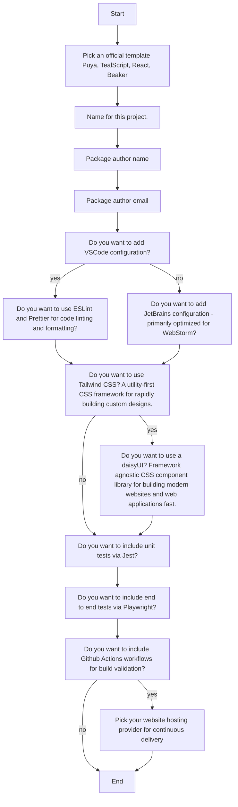
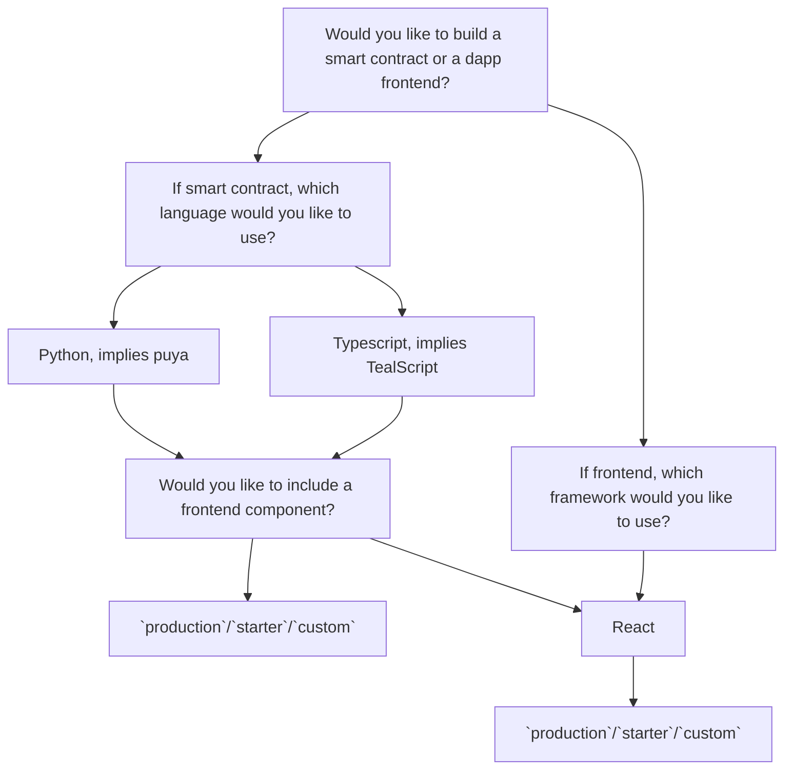

## AlgoKit Base Template and Generators Monorepo

**Status:** Proposed

**Owner:**

**Deciders:** [TBD]

**Date created:** 2024-01-23

TODO NOTES:

1. What init wizard v2 has to be? (ignoring how we implement it)
2. How to we improve existing templates? ()

### Context

Building upon the decisions made in the "Advanced algokit generate command" and "Frontend Templates" ADRs, we aim to further evolve the AlgoKit templating system aiming to improve the following aspects:

#### Wizard

- The existing init wizard is not beginner-friendly, relying certain Algorand-specific terminology. Simplifying the wizard and reducing the number of questions will enhance the onboarding experience for new users.
- Notion of `presets` is valuable and allowed to reduce number of default questions to be asked, but a deeper rethinking of the questions and the way they are asked is needed to make the wizard more user-friendly and less intimidating for beginners.

#### Templates

- The current fullstack template approach requires additional `injector` scripts to integrate new combinations of contracts and frontends, a process that will become more complex with the introduction of new languages like .NET.
- Lack of `codespaces` configurations that a user can rely on to get started with a new algokit template based project in a github codespaces environment.

#### CLI

- While algokit defines notions of `bootstrap`, `algokit.toml`, `.algokit` folder and conventions around `.env` variables used for smart contract deployment. They are not always directly managed by `algokit` cli, introducing more formal conventions around what defines an `algokit` compliant project can enable more consistent and convenient developer experience.

### 1. Init wizard v2 improvements

#### Option A - Simplify the questions

This is a general proposal to refine the init wizard v2 questions that can be improved as part of the new version of the wizard and is _unrelated_ to the further proposal of the monorepo and base template structure.

<table>
    <tr>
        <th>v1 wizard</th>
        <th>v2 wizard</th>
    </tr>
    <tr>
        <td>
<pre>



  </pre>
  </td>
  <td>
  <pre>



</pre>
</td>
</tr>
</table>

There are no explicit disadvantages to this proposal as this is a matter of refining the individual questions that are asked as part of the main algokit init flow. It is also worth noting that the proposed changes are not a breaking change from a standpoint of init command's behaviour since it only modifies the interactive aspects of the comman. Hencem, not expected to have any negative impact on the existing users of the init wizard.

### 2. Improved fullstack templates && algokit-cli command orchestration

#### Option A - Make full stack fully agnostic of frontend templates, introduce notion of command orchestration to algokit-cli

This 2 step approach suggests that we can offload the business logic that deals with linking smart contracts and frontens within fullstack into a self sufficient generator available in `react` template that the fullstack component can invoke. And suggests introducing notion of command orchestration to algokit-cli to manage the lifecycle of a project.

**Fullstack Template Structure**:

| Feature              | Before                                                                                                                                                                                                                                                     | After                                                                                                                                                                                                                                                                       |
| -------------------- | ---------------------------------------------------------------------------------------------------------------------------------------------------------------------------------------------------------------------------------------------------------- | --------------------------------------------------------------------------------------------------------------------------------------------------------------------------------------------------------------------------------------------------------------------------- |
| Template Integration | The current fullstack is tightly coupled with the frontend template, handling the connection between frontend and backend. This coupling necessitates additional safety checks whenever there are changes in the expected structure of the React template. | The frontend now invokes the import-contract generator within the React template, which autonomously manages the linkage with a smart contract project. This adjustment makes the fullstack less reliant on template-specific changes that it should not be concerned with. |

This gives us the following benefits:

- **Simplified Integration**: The frontend template can now autonomously manage the linkage with a smart contract project, reducing the need for additional safety checks and improving maintainability of official templates.
- **Improved templatization**: The fullstack template is further generalized allowing you to dynamically pick which smart contract language to use for backend component.

**AlgoKit CLI Command Orchestration**:

The goal is to enhance the reliance on algokit.toml files to consolidate `project` specific commands under `project` and move `boostrap` with `deploy` under it yet also allowing defining any extra number of arbitrary commands to be run in the context of the project.

### 3. Alternatives considered

#### Option A - Merging algokit templates into smaller sub-templates to be hosted on algokit-generators monorepo. Introducing a base template.

**Overview**: This proposal suggests consolidating AlgoKit templates into smaller, more focused sub-templates within a single `algokit-generators` monorepo. A base template will be introduced and integrated into the AlgoKit CLI, providing a standardized project structure.

**Base Template Structure**:

- Central folders: `contracts` for contract languages and `sites` for frontends.
- Includes essential files: `README.md`, `.gitignore`, `.algokit.toml`, and a `.algokit/` directory.

**AlgoKit Generators Monorepo**:

- A new `algokit-generators` repository will centralize custom generator development.
- Managed using NPM workspaces for efficient dependency handling.

**Entrypoint Commands**:

- Defined in the base template's `package.json`, including `build`, `dev`, `deploy`, and `test`.

### Pros

- Simplifies referencing of smart contracts in npm-centric projects (assuming those are also available as npm packages).
- Simplifies project orchestration in monorepo setups.

### Cons

- **Complexity**: The use of NPM workspaces and a monorepo approach forces dependency on NPM and diminishes the value of the existing cli capabilities, shifting orchestration to algokit-cli instead could give us more control over precise features we want to offer under `orchestration` (see PART 2 proposal).
- **Incompatibility with Copier**: The proposed structure does not align with Copier, complicating template updates and maintenance. In-fact copier recommends a single template per repository as part of [best practices for template development](https://copier.readthedocs.io/en/latest/configuring/#subdirectory).

## Preferred option

Part 1: Option A
Part 2: Option A

## Selected option

TBD

### Next Steps

1. Defining granular work items based on decided options.
2. Implementing the changes in the AlgoKit CLI and templates.
3. Updating the documentation and onboarding materials to reflect the new changes.
4. Announcing the changes to the community/DevRel and gathering feedback for further improvements.

```

```
