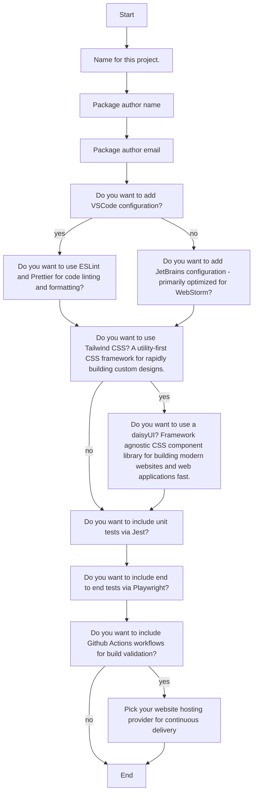
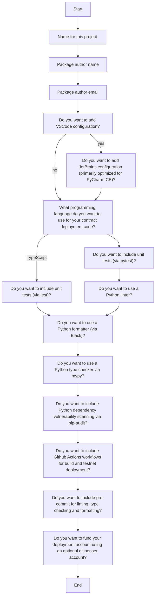
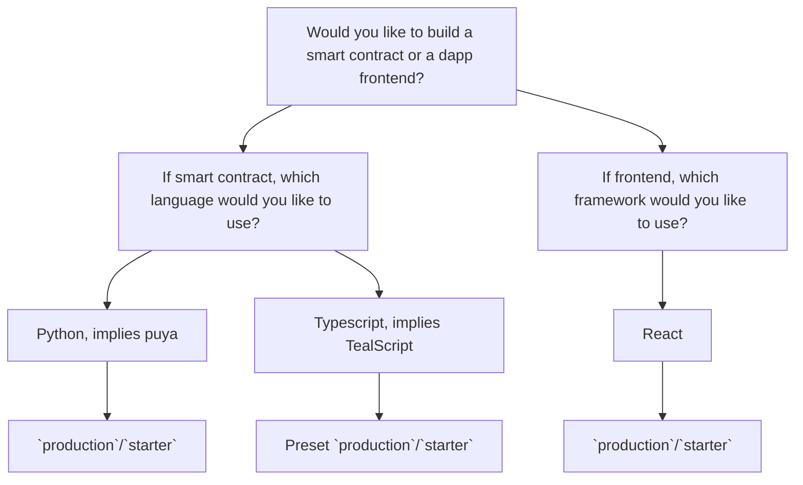

## AlgoKit Base Template and Generators Monorepo

**Status:** Proposed

**Owner:**

**Deciders:** [TBD]

**Date created:** 2024-01-23

### Context

Building upon the decisions made in the "Advanced algokit generate command" and "Frontend Templates" ADRs, we aim to further evolve the AlgoKit templating system aiming to improve the following aspects:

- The current fullstack template approach requires additional `injector` scripts to integrate new combinations of contracts and frontends, a process that will become more complex with the introduction of new languages like .NET.
- While algokit defines notions of `bootstrap`, `algokit.toml`, `.algokit` folder and conventions around `.env` variables used for smart contract deployment. They are not always directly managed by `algokit` cli, introducing more formal conventions around what defines an `algokit` compliant project can enable more consistent and convenient developer experience.
- The existing init wizard is not beginner-friendly, relying certain Algorand-specific terminology. Simplifying the wizard and reducing the number of questions will enhance the onboarding experience for new users.

### 1. Init wizard v2 improvements

#### Proposal A - Simplify the questions

This is a general proposal concernign the init wizard v2 questions that can be improved as part of the new version of the wizard and is _unrelated_ to the further proposal of the monorepo and base template structure.







There are no explicit disadvantages to this proposal as this is a matter of refining the individual questions that are asked as part of the main algokit init flow. It is also worth noting that the proposed changes are not a breaking change and are not expected to have any negative impact on the existing users of the init wizard.

### 2. Base Template Structure and Generators Monorepo

#### Proposal A - Merging algokit templates into smaller sub-templates to be hosted on algokit-generators monorepo. Introducing a base template.

The base template will be moved into the AlgoKit CLI and will contain a minimum set of folders and files to constitute a base template. This base template will include:

- A conventionally named folder, contracts, to host all sub-projects with specific contract languages.
- A folder named sites to host all sub-projects with specific frontends.

```
- README.md
- .gitignore
- .algokit.toml
- .algokit/
- contracts/
- sites/
```

This structure will provide a clear and consistent framework for developers to build upon, ensuring that all AlgoKit projects follow the same basic structure.

#### AlgoKit Generators Monorepo

A new repository, `algokit-generators`, will be created to serve as a monorepo for all custom generators. This repository will provide a centralized location for developers to find and contribute to the development of custom generators.

NPM workspaces will be utilized to manage the monorepo, providing a streamlined and efficient way to manage dependencies across the various generators.

#### Entrypoint Commands

The base template will define entrypoint commands such as:

- `build` (compile teal in the context of contracts, build frontend in the context of sites)
- `dev` (deploy to localnet in the context of contracts, start frontend with hot reload in the context of sites)
- `deploy` (deploy to target network in the context of contracts, deploy frontend to a static host in the context of sites)
- `test` (run tests in the context of contracts, run frontend tests in the context of sites)

These commands will be orchestrated by a root `package.json` file, providing a consistent interface for developers to interact with their AlgoKit projects.

### Consequences

This decision will result in a more streamlined and consistent developer experience when using AlgoKit. By providing a base template structure and a centralized location for custom generators, developers will have a clear framework to build upon and a single source of truth for custom generators.

However, this decision will also require significant work to implement, including the creation of the `algokit-generators` monorepo and the migration of the base template into the AlgoKit CLI. Additionally, the use of NPM workspaces to manage the monorepo may introduce complexity and potential issues with dependency management.

### Decision

TBD

### Next Steps

1. Implement the base template structure within the AlgoKit CLI.
2. Create the algokit-generators monorepo and migrate existing custom generators into it.
3. Implement NPM workspaces to manage the algokit-generators monorepo.
4. Define the entrypoint commands in the base template's package.json file.
5. Update documentation to reflect these changes and provide guidance for developers.
6. Test the new structure and monorepo to ensure they work as expected.
