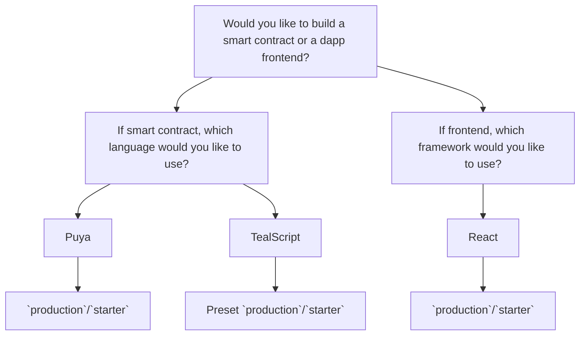

## AlgoKit Base Template and Generators Monorepo

**Status:** Proposed

**Owner:**

**Deciders:** [TBD]

**Date created:** 2024-01-23

### Context

Building upon the decisions made in the "Advanced algokit generate command" and "Frontend Templates" ADRs, we aim to further evolve the AlgoKit templating system with two main target audiences in mind. First, the users of the CLI, where the new experience should further abstract away Algorand specific concepts during the init wizard. Second, the Algorand Foundation engineers and maintainers of AlgoKit CLI, where the goal is to simplify the maintenance of the generators and templates by breaking the existing monolithic approach into a monorepo structure. This involves establishing a base template structure within the AlgoKit CLI and creating a new repository, algokit-generators, to serve as a monorepo for all custom generators.

### Proposal 1 - Monorepo powered by NPM workspaces

#### Refined init questions

Would you like to build a smart contract or a frontend?



#### Base Template Structure

The base template will be moved into the AlgoKit CLI and will contain a minimum set of folders and files to constitute a base template. This base template will include:

- A conventionally named folder, contracts, to host all sub-projects with specific contract languages.
- A folder named sites to host all sub-projects with specific frontends.

```
- README.md
- .gitignore
- .algokit.toml
- .algokit/
- contracts/
- sites/
```

This structure will provide a clear and consistent framework for developers to build upon, ensuring that all AlgoKit projects follow the same basic structure.

###### Notes

- having it as a repo allows to startup a github codespaces with base skeleton in-place + algokit pre-installed. User is then able to go ahead and rely on generators to expand the base to fit his needs.

#### AlgoKit Generators Monorepo

A new repository, `algokit-generators`, will be created to serve as a monorepo for all custom generators. This repository will provide a centralized location for developers to find and contribute to the development of custom generators.

NPM workspaces will be utilized to manage the monorepo, providing a streamlined and efficient way to manage dependencies across the various generators.

#### Entrypoint Commands

The base template will define entrypoint commands such as:

- `build` (compile teal in the context of contracts, build frontend in the context of sites)
- `dev` (deploy to localnet in the context of contracts, start frontend with hot reload in the context of sites)
- `deploy` (deploy to target network in the context of contracts, deploy frontend to a static host in the context of sites)
- `test` (run tests in the context of contracts, run frontend tests in the context of sites)

These commands will be orchestrated by a root `package.json` file, providing a consistent interface for developers to interact with their AlgoKit projects.

### Consequences

This decision will result in a more streamlined and consistent developer experience when using AlgoKit. By providing a base template structure and a centralized location for custom generators, developers will have a clear framework to build upon and a single source of truth for custom generators.

However, this decision will also require significant work to implement, including the creation of the `algokit-generators` monorepo and the migration of the base template into the AlgoKit CLI. Additionally, the use of NPM workspaces to manage the monorepo may introduce complexity and potential issues with dependency management.

### Decision

TBD

### Next Steps

1. Implement the base template structure within the AlgoKit CLI.
2. Create the algokit-generators monorepo and migrate existing custom generators into it.
3. Implement NPM workspaces to manage the algokit-generators monorepo.
4. Define the entrypoint commands in the base template's package.json file.
5. Update documentation to reflect these changes and provide guidance for developers.
6. Test the new structure and monorepo to ensure they work as expected.
