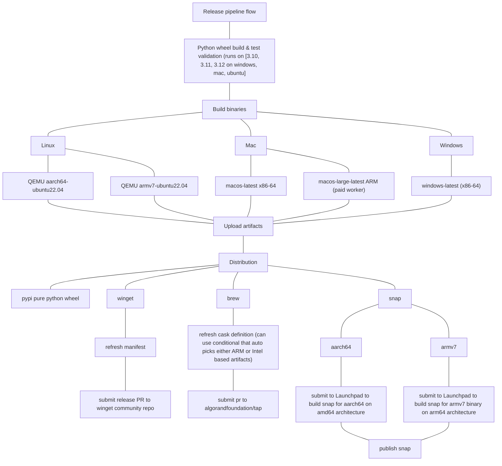
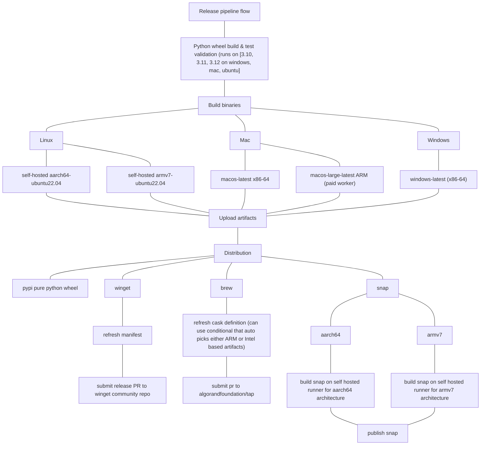
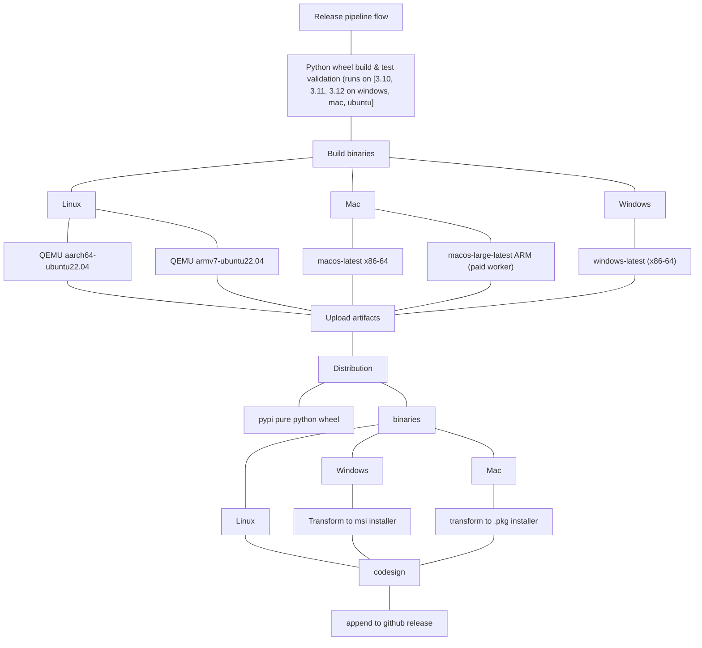

# AlgoKit CLI binary distribution

- **Status**: Draft
- **Owner:** Altynbek Orumbayev (MakerX)
- **Deciders**: Alessandro (Algorand Foundation), Rob Moore (MakerX), MakerX team
- **Date created**: 2024-01-31
- **Date decided:** TBD
- **Date updated**: 2024-01-31

## Context

The following ADR is a continuation of [native binaries](./2024-01-13_native_binaries.md) ADR. With initial workflows implemented, the goal is to determine the best way to distribute the native binaries to the end users.

## Requirements

- The solution should support a wide variety of Linux distributions, macOS (both Apple Silicon and Intel architectures), and Windows.
- The solution should allow distribution of native binaries via os specific package managers `brew`, `snap`, `winget`.

## Technical Constraints

- Pyinstaller binaries are dependend on the architecture and the OS. Github Actions mainly support `x86-64` architectures. This means that we need a self hosted runner to build binaries for `arm64` architectures OR use an alternative CI provider which has access to `arm64` and other architectures inside runners.
- Codesigning is a recommended practice for secure distribution and would need to be implemented on top of the initial workflows introduced as part of the implementation of the [native binaries](./2024-01-13_native_binaries.md) ADR.

## Options

### Option 1 - Binaries are only available via dedicated package managers using OSS solutions for multi architecture support

This approach assumes that native binaries are never available for direct consumption but instead extra tailored per each selected package manager. Additionally this approach assumes using OSS solutions for multi architecture support. Primarily using a QEMU/buildx based actions to build the binaries for different linux architecutres, using paid m1 github runner for arm macos binaries, using default macos runner for x86 macos binaries and using default windows runner for x86-64 windows binaries.

Diagram:

#### General pros and cons

**Pros**

- Ability to rely on package manager to handle installation, updates and removal of the binaries
- OSS solutions for multi architecture support are available and can be used to build the binaries for different architectures on Linux using QEMU

**Cons**

- Increase complexity of release pipeline as we need to introduce additional steps to build the binaries for different architectures as well as introduce tailored workflows for each package manager
- PoC tests on building pyinstaller inside QEMU armv7 ubuntu images are proven to be **extremely** slow (up to an hour without cached based docker images). Additionally the build process is complicated by the fact that wheels like `cryptography` require `rust` to be installed as part of building the wheel, which increases the build time even further.

#### Snap

**Pros**

- Snap is available on all major Linux distributions
- Ubuntu provides a Launchpad platform that simplifies compiling snaps on different architectures remotely
- Snap supports distribution of pyinstaller binaries (verified in a PoC on a fork of algokit-cli)

**Cons**

- Snap provides a native support for pyhon applications which may be simpler to use than pyinstaller rather than distributing the binaries as it allows us to rely directly on remote Launchpad builds instead of pre-building the binaries per each architecture
- If we are to distribute pyinstaller binaries, the binaries itself need to be cross compiled on target architecutres. Currently we get `amd64` binaries with `ubuntu` runners, however we would need to introduce extra self hosted runners to get `arm64` binaries. In this case we would need to run building of binaries AND building of snaps in build matrices consiting of default `ubuntu` runners and self hosted `arm64` runners. This will increase the build time and complexity of the build process.

#### Brew

**Pros**

- A flow for distributing algokit wheel via `brew` is already established
- Brew supports distribution of pyinstaller binaries (verified in a PoC on a fork of algokit-cli)
- Will require minor changes in the existing brew workflow to operate with binary artifacts instead of wheel artifacts

**Cons**

- Algokit cli relies on dependencies that are not `fat` binaries. This means we can't use pyinstaller to target `universal2` architecture and instead need to build the binaries for each architecture separately. Hence using a paid ARM macos runner is a simple solution to get binaries for Apple Silicon.
- Codesigning is required for distribution of binaries via `brew`. This means that we need to have a valid Apple Developer account and a valid certificate to sign the binaries. While this is a good practice regardless, listing this as a con given non deterministic nature of obtaining a valid certificate from Apple.
- Separate ARM worker for apple silicon binaries is required. Github provides beta version of such runners for with paid billing plans.

#### Winget

**Pros**

- Winget is available on all major Windows distributions
- Winget supports distribution of pyinstaller binaries
- Will require minor changes in the existing brew workflow to convert pyinstaller .exe binaries to winget .msi binaries

**Cons**

- Winget requires contributing the manifest file to an open source repository which may cause potential delays in the distribution of the binaries as each PR needs to be reviewed and approved by the maintainers of the repository.

#### Conclusion

All of the above package managers are viable and can be used to distribute the pyinstaller build binaries. Requirement on supporting additional architectures like `arm64` introduce unique challenges that ideally should be addressed by introducing custom self hosted runners to the build matrix. This will increase the complexity of the build process and will require additional maintenance of the runners.

### Option 2 - Binaries are only available via dedicated package managers using self hosted runners for multi architecture support

This is identical to the option 1 with the exception that we are using self hosted runners to build the binaries for different architectures.

Diagram:

#### General pros and cons

**Pros**

- Simplified build matrix as we can simply define additional `runs-on` for each architecture we want to support to target our custom self hosted runners
- Same pros as option 1

**Cons**

- Self hosted runners require additional maintenance, very careful configuration and security considerations. This is a non trivial task and will require additional resources to maintain implement. The main issue with self-hosted runners is that Github generally does not recommend using them for public repositories as forked repositories can potentially gain access to the self hosted runners. There is a lot of workarounds to this issue, but it is still a non trivial task to implement and maintain.

### Option 3 - Binaries are available for direct consumption as self contained executables

This approach assumes that native binaries are available for direct consumption as self contained executables. This means that the binaries are not distributed via package managers but instead are available for direct download from the Algorand Foundation website/dedicated installer script that needs to be introduce. The script can figure out the operating system, architecture and pull the correct binary from public github releases page.

Diagram:

#### General pros and cons

**Pros**

- Ability to distribute binaries for all supported architectures without extra complexity of maintaining distributions via package managers `brew`, `snap`, `winget`
- Self update mechanism can be implemented within the algokit cli to check for updates and pull newer versions of the binaries. This will allow users to always have the latest version of the binaries without the need to wait for the package manager to update the binaries.

**Cons**

- Users who prefer to use package managers will need to manually install the binaries and keep track of the updates
- Self update mechanism will require additional maintenance and testing to ensure correct handling of the updates

### Option 4 - Binaries are available for direct consumption as self contained executables, dedicated package managers distribute the wheels

This approach combines option 1 and option 3. This means that we are distributing the binaries for direct consumption as self contained executables and additionally we are distributing the wheels via package managers.

**Pros**

- Ability to distribute binaries for all supported architectures without extra complexity of maintaining distributions via package managers `brew`, `snap`, `winget`
- Ability to rely on python optimizations in dedicated package managers like `snap` and `brew` to distribute the wheel artifacts

**Cons**

- Does not eliminate dependency on python to run the algokit cli when using package managers
- Self update mechanism will require additional maintenance and testing to ensure correct handling of the updates and is at risk of not being used that often if users will still primarily rely on package managers or `pipx` to install the algokit cli

## Preferred option

TBD

## Selected option

TBD

## Next Steps

TBD

## Open questions

Do we want to build the binaries for ARM based windows machines? If so, this implies that we need to introduce self hosted runners for windows as well given that there seems to be no OSS options to build the binaries for ARM based windows machines in Github Actions.
