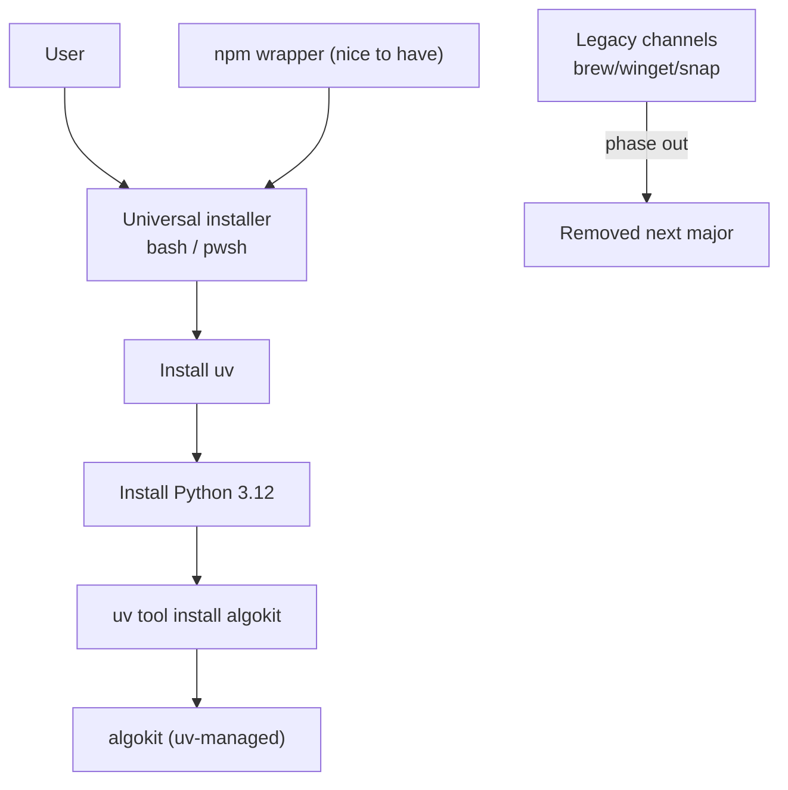
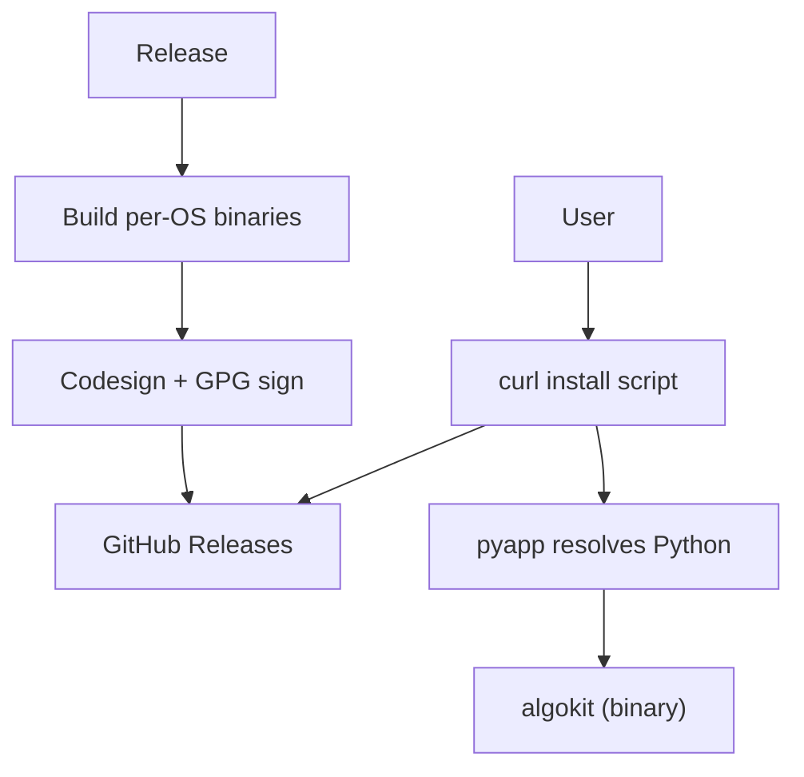
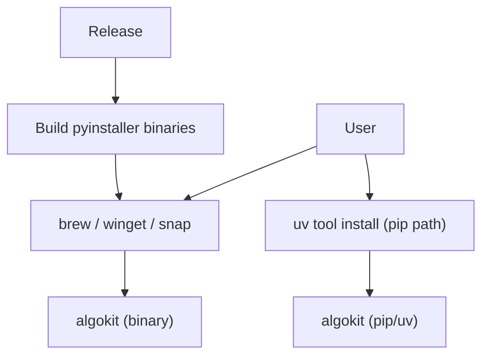

# Simplify AlgoKit CLI distribution (2026)

- **Status:** Draft for discussion
- **Date:** 2026-02-05
- **Why now:** The current pipeline needs Apple Developer + Canonical + Winget community workflows, and still ships a binary that does not help users get Python when they open a template in an IDE. PyInstaller was the most mature choice at the time, but by 2026 there are solid alternatives.

## Goal

- Reduce distribution surface area and account overhead.
- Make installs handle Python for users.
- Keep migration non-disruptive for existing users.

## Current moving parts (just enough map)

- Build + publish binaries: `.github/workflows/build-binaries.yaml`, `.github/actions/build-binaries/*`, `.github/workflows/publish-release-packages.yaml`.
- PyInstaller packaging: `pyproject.toml` (`package_*` tasks + dependency), `scripts/package_mac.sh`, `scripts/package_windows.bat`.
- Channel scripts: `scripts/update-brew-cask.sh`, `scripts/snap/create-snapcraft-yaml.sh`, `scripts/winget/*`.
- PyInstaller-only tests: `tests/portability/test_pyinstaller_binary.py`, `pyproject.toml` marker `pyinstaller_binary_tests`.
- Update hints: `src/algokit/core/config_commands/version_prompt.py` (distribution-method + update command).
- Install/tool checks: `src/algokit/cli/doctor.py` (pipx/brew/winget).
- Docs: `README.md`, `docs/tutorials/intro.md`, `docs/features/*`.

## Alternatives that exist now (2026)

- `pyapp` (https://ofek.dev/pyapp/latest/) for dynamic Python resolution in binaries.
- `uvget`-style installers (https://github.com/aorumbayev/uvget) to bootstrap uv + Python + tool install.
- Other packaging options: Nuitka, PEX, Shiv (less relevant if we stop shipping binaries).

## Option A: uvget-style installer + `uv tool install algokit`

Single bash + pwsh entrypoint that fetches uv, pulls Python 3.12, then installs AlgoKit with `uv tool install`. This becomes the default path; brew/winget/snap stay but are marked legacy and removed next major.

**What changes (codebase impact)**

- CI/CD: add a job that publishes installer scripts + checksums/signatures; keep `build-binaries` + `publish-release-packages` during the legacy period, then remove in the next major.
- Packaging: remove `pyinstaller` from `pyproject.toml` and drop `package_*` tasks after the legacy period; retire `scripts/package_*` at the same time.
- Channels: remove/retire `scripts/update-brew-cask.sh`, `scripts/snap/*`, `scripts/winget/*` once legacy period ends.
- Runtime hints: update `src/algokit/core/config_commands/version_prompt.py` to include `uv` update guidance (and add a new distribution-method for `uv` installs).
- Doctor + docs: update `src/algokit/cli/doctor.py`, `README.md`, `docs/tutorials/intro.md`, `docs/features/*` to prefer uv and mark brew/winget/snap as legacy.
- Tests: replace `tests/portability/test_pyinstaller_binary.py` with installer smoke tests (e.g., run the script, verify `algokit doctor` / `algokit init`).
- Internal tool resolution: migrate pipx-based helpers (typed client generation, compiler installs, tealer install, poetry bootstrap) to uv equivalents (`uv tool run` / `uvx`).
- CLI update command: add `algokit update` behind a feature flag. Initially no-op or hidden; once binaries are removed, it becomes the default update path and runs `uv tool upgrade algokit`. If a legacy binary install is detected (via binary mode + distribution-method), it can launch a migration wizard on startup that points to the universal installer script and offers to install the legacy version first (nice to have).
- npm channel: publish a small npm wrapper that invokes the universal installer (nice to have, easy once Option A exists).

**Smooth migration for existing brew/winget/snap users**

- Phase 1: keep publishing binaries, but add a deprecation note in docs + release notes + `algokit doctor` output for those distribution methods.
- Phase 2: add explicit upgrade guidance in CLI (`algokit version-prompt` message for brew/winget/snap users pointing at the new install command).
- Phase 3 (next major): stop new package manager releases, keep uninstall guidance; optionally publish a last “bridge” release that only shows the migration message.

**Pros**

- One installer path, fewer accounts and CI steps.
- Solves “binary but no Python in IDE” by owning Python install.
- Easier to support consistent behavior across OSes.

**Cons**

- Requires trust in a bootstrap script + network access.
- Adds uv as a required bootstrap dependency.
- Needs careful messaging to avoid churn for existing users.

## Option B: keep binaries, move to `pyapp` + curl + GPG-signed releases

Drop brew/winget/snap; ship signed binaries via GH releases and a curl-based installer. `pyapp` handles Python resolution at runtime.

**Pros**

- Fewer distribution channels and less package manager overhead.
- Python resolution is handled by `pyapp` (better than today’s binaries).

**Cons**

- Still a binary pipeline; still per-OS builds and likely code signing on macOS.
- Update experience is still manual unless we build a self-update story.
- Might still be less flexible than uv-driven installs for toolchain workflows.

## Option C: keep current binaries, switch pipx to `uv tool install`

Leave distribution as-is, but move pip-based installs from pipx to uv. This is the smallest change.

**What changes**

- Update `src/algokit/core/utils.py` + call sites that use pipx for tool resolution (typed client generation, compiler install, tealer install, poetry bootstrap).
- Update tests and docs that reference pipx (e.g., `docs/features/compile.md`, `docs/features/generate.md`, `README.md`).

**Trade-off**

- Low effort; does not reduce distribution complexity or account needs.
- Still leaves “binary install doesn’t manage Python” unaddressed.

## Notes / open questions

- Python pin: target Python 3.12 for the uv-based install.
- Installer scope: limit to AlgoKit CLI + Python only. Project dependencies are handled via `algokit init` + bootstrap; that flow can install some tools (e.g., Poetry) but still assumes system prerequisites like Node and Docker (see `docs/features/init.md`, `docs/features/project/bootstrap.md`).
- Remaining question: hard EOL date for brew/winget/snap vs keep as best effort?
