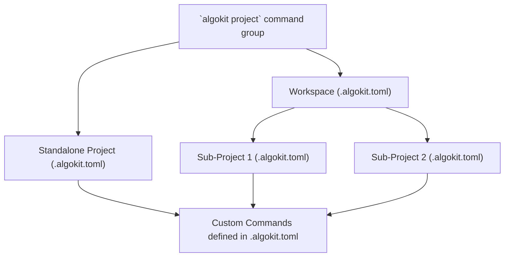

# AlgoKit Project

`algokit project` is a collection of commands and command groups useful for managing algokit compliant [project workspaces](./init.md#workspaces).

## Overview

The `algokit project` command group is designed to simplify the management of AlgoKit projects. It provides a suite of tools to initialize, deploy, link, list, and run various components within a project workspace. This command group ensures that developers can efficiently handle the lifecycle of their projects, from bootstrapping to deployment and beyond.

### What is a Project?

In the context of AlgoKit, a "project" refers to a structured standalone or monorepo workspace that includes all the necessary components for developing, testing, and deploying Algorand applications. This may include smart contracts, frontend applications, and any associated configurations. In the context of the CLI, the `algokit project` commands help manage these components cohesively.

The orchestration between workspaces, standalone projects, and custom commands is designed to provide a seamless development experience. Below is a high-level overview of how these components interact within the AlgoKit ecosystem.



- **AlgoKit Project**: The root command that encompasses all project-related functionalities.
- **Workspace**: A root folder that is managing multiple related sub-projects.
- **Standalone Project**: An isolated project structure for simpler applications.
- **Custom Commands**: Commands defined by the user in the `.algokit.toml` and automatically injected into the `algokit project run` command group.

### Workspaces vs Standalone Projects

As mentioned, AlgoKit supports two distinct project structures: Workspaces and Standalone Projects. This flexibility allows developers to choose the most suitable approach for their project's needs.

### Workspaces

Workspaces are designed for managing multiple related projects under a single root directory. This approach is beneficial for complex applications that consist of multiple sub-projects, such as a smart contract and a corresponding frontend application. Workspaces help in organizing these sub-projects in a structured manner, making it easier to manage dependencies and shared configurations.

To initialize a project within a workspace, use the `--workspace` flag. If a workspace does not already exist, AlgoKit will create one for you by default (unless you disable it via `--no-workspace` flag). Once established, new projects can be added to this workspace, allowing for centralized management.

To mark your project as `workspace` fill in the following in your `.algokit.toml` file:

```toml
[project]
type = 'workspace' # type specifying if the project is a workspace or standalone
projects_root_path = 'projects' # path to the root folder containing all sub-projects in the workspace
```

#### VSCode optimizations

AlgoKit has a set of minor optimizations for VSCode users that are useful to be aware of:

- Templates created with the `--workspace` flag automatically include a VSCode code-workspace file. New projects added to an AlgoKit workspace are also integrated into an existing VSCode workspace.
- Using the `--ide` flag with `init` triggers automatic prompts to open the project and, if available, the code workspace in VSCode.

#### Handling of the `.github` Folder

A key aspect of using the `--workspace` flag is how the `.github` folder is managed. This folder, which contains GitHub-specific configurations such as workflows and issue templates, is moved from the project directory to the root of the workspace. This move is necessary because GitHub does not recognize workflows located in subdirectories.

Here's a simplified overview of what happens:

1. If a `.github` folder is found in your project, its contents are transferred to the workspace's root `.github` folder.
2. Files with matching names in the destination are not overwritten; they're skipped.
3. The original `.github` folder is removed if it's left empty after the move.
4. A notification is displayed, advising you to review the moved `.github` contents to ensure everything is in order.

This process ensures that your GitHub configurations are properly recognized at the workspace level, allowing you to utilize GitHub Actions and other features seamlessly across your projects.

### Standalone Projects

Standalone projects are suitable for simpler applications or when working on a single component. This structure is straightforward, with each project residing in its own directory, independent of others. Standalone projects are ideal for developers who prefer simplicity or are focusing on a single aspect of their application and are sure that they will not need to add more sub-projects in the future.

To create a standalone project, use the `--no-workspace` flag during initialization. This instructs AlgoKit to bypass the workspace structure and set up the project as an isolated entity.

Both workspaces and standalone projects are fully supported by AlgoKit's suite of tools, ensuring developers can choose the structure that best fits their workflow without compromising on functionality.

To mark your project as a standalone project fill in the following in your `.algokit.toml` file:

```toml
[project]
type = {'backend' | 'contract' | 'frontend'} # currently support 3 generic categories for standalone projects
name = 'my-project' # unique name for the project inside workspace
```

> We recommend using workspaces for most projects (hence enabled by default), as it provides a more organized and scalable approach to managing multiple sub-projects. However, standalone projects are a great choice for simple applications or when you are certain that you will not need to add more sub-projects in the future, for such cases simply append `--no-workspace` when using `algokit init` command. For more details on init command please refer to [init](./init.md) command docs.

## Features

Dive into the features of the `algokit project` command group:

- [bootstrap](./project/bootstrap.md) - Bootstrap your project with AlgoKit.
- [deploy](./project/deploy.md) - Deploy your smart contracts effortlessly to various networks.
- [link](./project/link.md) - Powerful feature designed to streamline the integration between `frontend` and `contract` projects
- [list](./project/list.md) - Enumerate all projects within an AlgoKit workspace.
- [run](./project/run.md) - Define custom commands and manage their execution via `algokit` cli.
