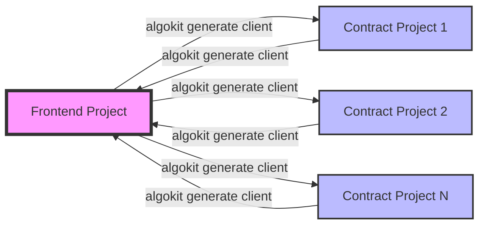

# AlgoKit Project Link Command

The `algokit project link` command is a powerful feature designed to streamline the integration between `frontend` and `contract` typed projects within the AlgoKit ecosystem. This command facilitates the automatic path resolution and invocation of [`algokit generate client`](../generate.md#1-typed-clients) on `contract` projects available in the workspace, making it easier to integrate smart contracts with frontend applications.

## Usage

To use the `link` command, navigate to the root directory of your standalone frontend project and execute:

```sh
$ algokit project link [OPTIONS]
```

This command must be invoked from the root of a standalone 'frontend' typed project.

## Options

- `--project-name`, `-p`: Specify one or more contract projects for the command. If not provided, the command defaults to all contract projects in the current workspace. This option can be repeated to specify multiple projects.

- `--language`, `-l`: Set the programming language of the generated client code. The default is `typescript`, but you can specify other supported languages as well.

- `--all`, `-a`: Link all contract projects with the frontend project. This option is mutually exclusive with `--project-name`.

- `--fail-fast`, `-f`: Exit immediately if at least one client generation process fails. This is useful for CI/CD pipelines where you want to ensure all clients are correctly generated before proceeding.

- `--version`, `-v`: Allows specifying the version of the client generator to use when generating client code for contract projects. This can be particularly useful for ensuring consistency across different environments or when a specific version of the client generator includes features or fixes that are necessary for your project.

## How It Works

Below is a visual representation of the `algokit project link` command in action:



1. **Project Type Verification**: The command first verifies that it is being executed within a standalone frontend project by checking the project's type in the `.algokit.toml` configuration file.

2. **Contract Project Selection**: Based on the provided options, it selects the contract projects to link. This can be all contract projects within the workspace, a subset specified by name, or a single project selected interactively.

3. **Client Code Generation**: For each selected contract project, it generates typed client code using the specified language. The generated code is placed in the frontend project's directory specified for contract clients.

4. **Feedback**: The command provides feedback for each contract project it processes, indicating success or failure in generating the client code.

## Example

Linking all contract projects with a frontend project and generating TypeScript clients:

```sh
$ algokit project link --all -l typescript
```

This command will generate TypeScript clients for all contract projects and place them in the specified directory within the frontend project.

## Further Reading

To learn more about the `algokit project link` command, please refer to [link](../../cli/index.md#link) in the AlgoKit CLI reference documentation.
