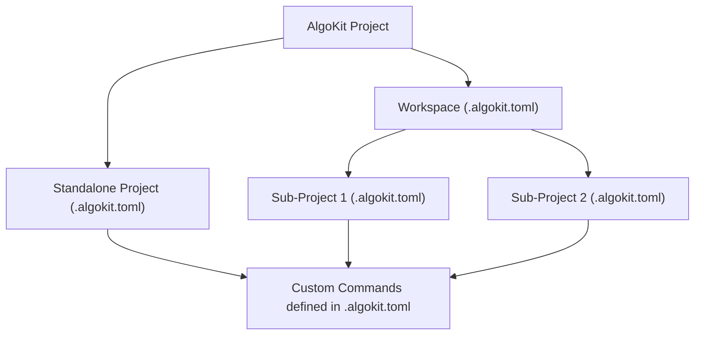

# AlgoKit Project Run

The `algokit project run` command allows defining custom commands to execute at standalone project level or being orchestrated from a workspace containing multiple standalone projects.

## Usage

```sh
$ algokit project run [OPTIONS] COMMAND [ARGS]
```

This command executes a custom command defined in the `.algokit.toml` file of the current project or workspace.

### Options

- `-l, --list`: List all projects associated with the workspace command. (Optional)
- `-p, --project-name`: Execute the command on specified projects. Defaults to all projects in the current directory. (Optional)
- `-t, --type`: Limit execution to specific project types if executing from workspace. (Optional)
- `-s, --sequential`: Execute workspace commands sequentially, for cases where you do not have a preference on the execution order, but want to disable concurrency. (Optional, defaults to concurrent)
- `[ARGS]...`: Additional arguments to pass to the custom command. These will be appended to the end of the command specified in the `.algokit.toml` file.

To get detailed help on the above options, execute:

```bash
algokit project run {name_of_your_command} --help
```

### Workspace vs Standalone Projects

AlgoKit supports two main types of project structures: Workspaces and Standalone Projects. This flexibility caters to the diverse needs of developers, whether managing multiple related projects or focusing on a single application.

- **Workspaces**: Ideal for complex applications comprising multiple sub-projects. Workspaces facilitate organized management of these sub-projects under a single root directory, streamlining dependency management and shared configurations.

- **Standalone Projects**: Suited for simpler applications or when working on a single component. This structure offers straightforward project management, with each project residing in its own directory, independent of others.

> Please note, instantiating a workspace inside a workspace (aka 'workspace nesting') is not supported and not recommended. When you want to add a new project into existing workspace make sure to run `algokit init` **from the root of the workspace**

### Custom Command Injection

AlgoKit enhances project automation by allowing the injection of custom commands into the `.algokit.toml` configuration file. This feature enables developers to tailor the project setup to their specific needs, automating tasks such as deploying to different network environments or integrating with CI/CD pipelines.

## How It Works

The orchestration between workspaces, standalone projects, and custom commands is designed to provide a seamless development experience. Below is a high-level overview of how these components interact within the AlgoKit ecosystem.



- **AlgoKit Project**: The root command that encompasses all project-related functionalities.
- **Workspace**: A root folder that is managing multiple related sub-projects.
- **Standalone Project**: An isolated project structure for simpler applications.
- **Custom Commands**: Commands defined by the user in the `.algokit.toml` and automatically injected into the `algokit project run` command group.

### Workspace cli options

Below is only visible and available when running from a workspace root.

- `-l, --list`: List all projects associated with the workspace command. (Optional)
- `-p, --project-name`: Execute the command on specified projects. Defaults to all projects in the current directory. (Optional)
- `-t, --type`: Limit execution to specific project types if executing from workspace. (Optional)
  To get a detailed help on the above commands execute:

```bash
algokit project run {name_of_your_command} --help
```

## Examples

Assume you have a default workspace with the following structure:

```bash
my_workspace
├── .algokit.toml
├── projects
│   ├── project1
│   │   └── .algokit.toml
│   └── project2
│       └── .algokit.toml
```

The workspace configuration file is defined as follows:

```toml
# ... other non [project.run] related metadata
[project]
type = 'workspace'
projects_root_path = 'projects'
# ... other non [project.run] related metadata
```

Standalone configuration files are defined as follows:

```toml
# ... other non [project.run] related metadata

[project]
type = 'contract'
name = 'project_a'

[project.run]
hello = { commands = ['echo hello'], description = 'Prints hello' }

# ... other non [project.run] related metadata
```

```toml
# ... other non [project.run] related metadata

[project]
type = 'frontend'
name = 'project_b'

[project.run]
hello = { commands = ['echo hello'], description = 'Prints hello' }

# ... other non [project.run] related metadata
```

Executing `algokit project run hello` from the root of the workspace will concurrently execute `echo hello` in both `project_a` and `project_b` directories.

Executing `algokit project run hello` from the root of `project_(a|b)` will execute `echo hello` in the `project_(a|b)` directory.

### Controlling Execution Order

Customize the execution order of commands in workspaces for precise control:

1. Define order in `.algokit.toml`:

   ```yaml
   [project]
   type = 'workspace'
   projects_root_path = 'projects'

   [project.run]
   hello = ['project_a', 'project_b']
   ```

2. Execution behavior:
   - Projects are executed in the specified order
   - Invalid project names are skipped
   - Partial project lists: Specified projects run first, others follow

> Note: Explicit order always triggers sequential execution.

### Controlling Concurrency

You can control whether commands are executed concurrently or sequentially:

1. Use command-line options:

   ```sh
   $ algokit project run hello -s  # or --sequential
   $ algokit project run hello -c  # or --concurrent
   ```

2. Behavior:
   - Default: Concurrent execution
   - Sequential: Use `-s` or `--sequential` flag
   - Concurrent: Use `-c` or `--concurrent` flag or omit the flag (defaults to concurrent)

> Note: When an explicit order is specified in `.algokit.toml`, execution is always sequential regardless of these flags.

### Passing Extra Arguments

You can pass additional arguments to the custom command. These extra arguments will be appended to the end of the command specified in your `.algokit.toml` file.

Example:

```sh
$ algokit project run hello -- world
```

In this example, if the `hello` command in `.algokit.toml` is defined as `echo "Hello"`, the actual command executed will be `echo "Hello" world`.

## Further Reading

To learn more about the `algokit project run` command, please refer to [run](../../cli/index.md#run) in the AlgoKit CLI reference documentation.
