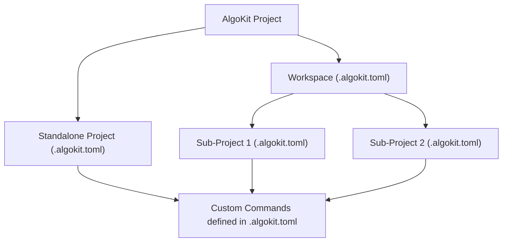

# algokit project run {custom command}

AlgoKit provides a robust set of features designed to streamline the development of Algorand projects. Among these, the `algokit project` command stands out by offering a suite of sub-commands tailored for project management, including initialization, bootstrapping, deploying, and custom command injection. This document outlines the key aspects of these features, the distinction between workspace and standalone projects, and how custom commands are seamlessly integrated into your workflow.

## Overview

The `algokit project` command is a gateway to several functionalities that simplify the management of Algorand projects. It allows for the initialization of new projects, bootstrapping dependencies, deploying smart contracts, and more. One of the powerful aspects of AlgoKit is its ability to inject custom commands into the project, enhancing flexibility and automation capabilities.

### Workspace vs Standalone Projects

AlgoKit supports two main types of project structures: Workspaces and Standalone Projects. This flexibility caters to the diverse needs of developers, whether managing multiple related projects or focusing on a single application.

- **Workspaces**: Ideal for complex applications comprising multiple sub-projects. Workspaces facilitate organized management of these sub-projects under a single root directory, streamlining dependency management and shared configurations.

- **Standalone Projects**: Suited for simpler applications or when working on a single component. This structure offers straightforward project management, with each project residing in its own directory, independent of others.

### Custom Command Injection

AlgoKit enhances project automation by allowing the injection of custom commands into the `.algokit.toml` configuration file. This feature enables developers to tailor the project setup to their specific needs, automating tasks such as deploying to different network environments or integrating with CI/CD pipelines.

## How It Works

The orchestration between workspaces, standalone projects, and custom commands is designed to provide a seamless development experience. Below is a high-level overview of how these components interact within the AlgoKit ecosystem.

- **AlgoKit Project**: The root command that encompasses all project-related functionalities.
- **Workspace**: A root folder that is managing multiple related sub-projects.
- **Standalone Project**: An isolated project structure for simpler applications.
- **Custom Commands**: Commands defined by the user in the `.algokit.toml` and automatically injected into `algokit project` command group when running `algokit project` from a root of a workspace containing standalone projects with custom commands or directly from a standalone project with custom commands defined in `.algokit.toml` file.

## Conclusion

AlgoKit's project features offer a comprehensive toolkit for Algorand developers, accommodating both complex multi-component applications and simpler, standalone projects. The ability to inject custom commands further enhances the development workflow, making AlgoKit a versatile choice for building on the Algorand blockchain.
