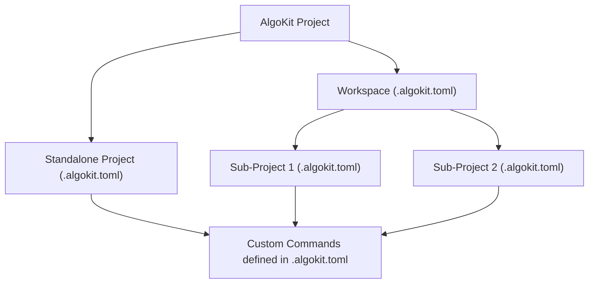

# AlgoKit Project Run

The `algokit project run` command allows defining custom commands to execute at standalone project level or being orchestrated from a workspace containing multiple standalone projects.

## Usage

```sh
$ algokit project run [OPTIONS] COMMAND [ARGS]
```

This command executes a custom command defined in the `.algokit.toml` file of the current project or workspace.

### Workspace vs Standalone Projects

AlgoKit supports two main types of project structures: Workspaces and Standalone Projects. This flexibility caters to the diverse needs of developers, whether managing multiple related projects or focusing on a single application.

- **Workspaces**: Ideal for complex applications comprising multiple sub-projects. Workspaces facilitate organized management of these sub-projects under a single root directory, streamlining dependency management and shared configurations.

- **Standalone Projects**: Suited for simpler applications or when working on a single component. This structure offers straightforward project management, with each project residing in its own directory, independent of others.

### Custom Command Injection

AlgoKit enhances project automation by allowing the injection of custom commands into the `.algokit.toml` configuration file. This feature enables developers to tailor the project setup to their specific needs, automating tasks such as deploying to different network environments or integrating with CI/CD pipelines.

## How It Works

The orchestration between workspaces, standalone projects, and custom commands is designed to provide a seamless development experience. Below is a high-level overview of how these components interact within the AlgoKit ecosystem.



- **AlgoKit Project**: The root command that encompasses all project-related functionalities.
- **Workspace**: A root folder that is managing multiple related sub-projects.
- **Standalone Project**: An isolated project structure for simpler applications.
- **Custom Commands**: Commands defined by the user in the `.algokit.toml` and automatically injected into the `algokit project run` command group.

### Workspace cli options

Below is only visible and available when running from a workspace root.

- `-l, --list`: Outputs all projects containing the command with the same name.
- `-p, --project_name`: Allows specifying a specific project or projects to run the command.

To get a detailed help on the above commands execute:

```bash
algokit project run {name_of_your_command} --help
```

## Examples

Assume you have a default workspace with the following structure:

```bash
my_workspace
├── .algokit.toml
├── projects
│   ├── project1
│   │   └── .algokit.toml
│   └── project2
│       └── .algokit.toml
```

The workspace configuration file is defined as follows:

```toml
# ... other non [project.run] related metadata
[project]
type = 'workspace'
projects_root_path = 'projects'
# ... other non [project.run] related metadata
```

Standalone configuration files are defined as follows:

```toml
# ... other non [project.run] related metadata

[project]
type = 'contract'
name = 'project_a'

[project.run]
hello = { commands = ['echo hello'], description = 'Prints hello' }

# ... other non [project.run] related metadata
```

```toml
# ... other non [project.run] related metadata

[project]
type = 'frontend'
name = 'project_b'

[project.run]
hello = { commands = ['echo hello'], description = 'Prints hello' }

# ... other non [project.run] related metadata
```

Executing `algokit project run hello` from the root of the workspace will concurrently execute `echo hello` in both `project_a` and `project_b` directories.

Executing `algokit project run hello` from the root of `project_(a|b)` will execute `echo hello` in the `project_(a|b)` directory.

### Controlling order of execution

To control order of execution, simply define the order for a particular command as follows:

```yaml
# ... other non [project.run] related metadata
[project]
type = 'workspace'
projects_root_path = 'projects'

[project.run]
hello = ['project_a', 'project_b']
# ... other non [project.run] related metadata
```

Now if project_a and project_b are both defined as standalone projects, the order of execution will be respected. Additional behaviour can be described as follows:

- Providing invalid project names will skip the execution of the command for the invalid project names.
- If only a subset of projects declaring this command are specified, the order of execution will be respected for the subset of projects first before the rest of the projects are executed in non-deterministic order.

> Please note, when enabling explicit order of execution all commands will always run sequentially.

## Further Reading

For in-depth details, visit the [run](../../cli/index.md#run) section in the AlgoKit CLI reference documentation.
