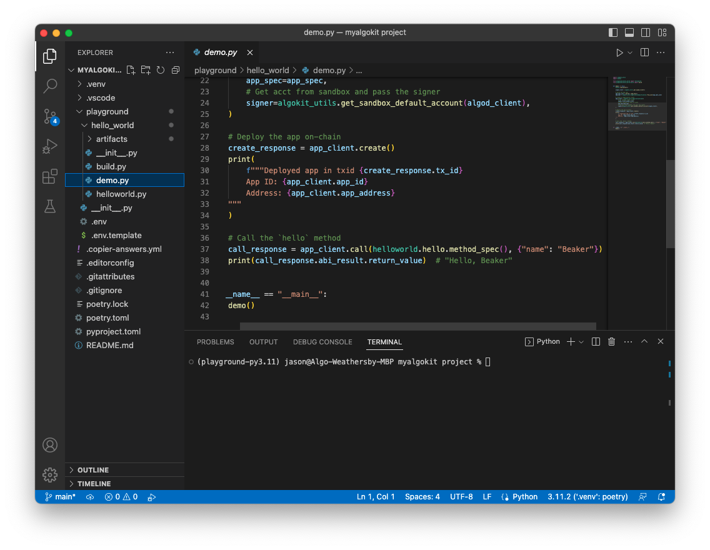
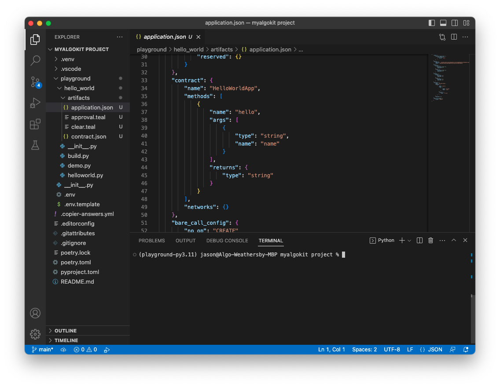
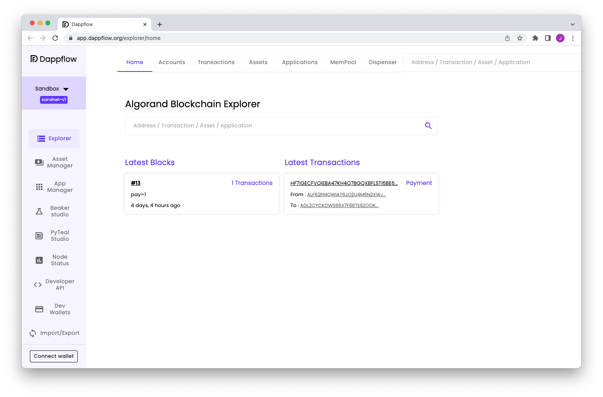
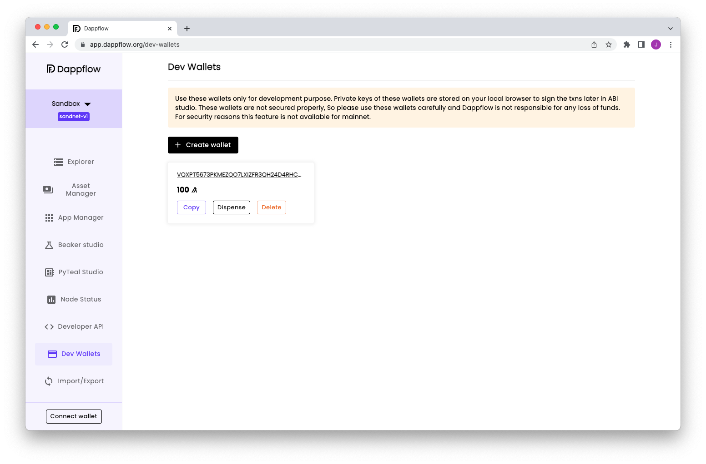
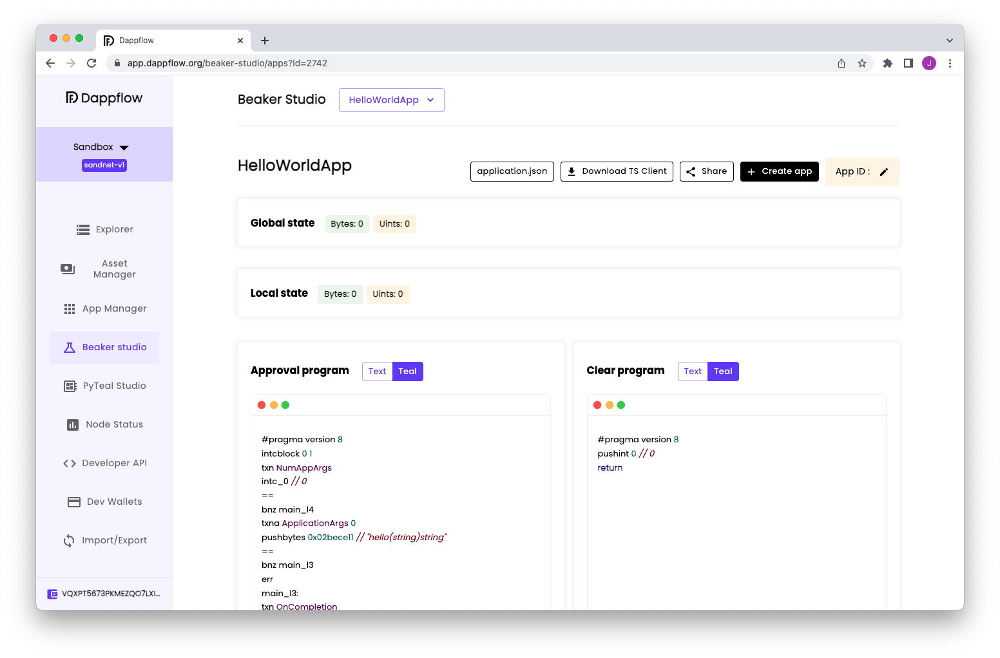
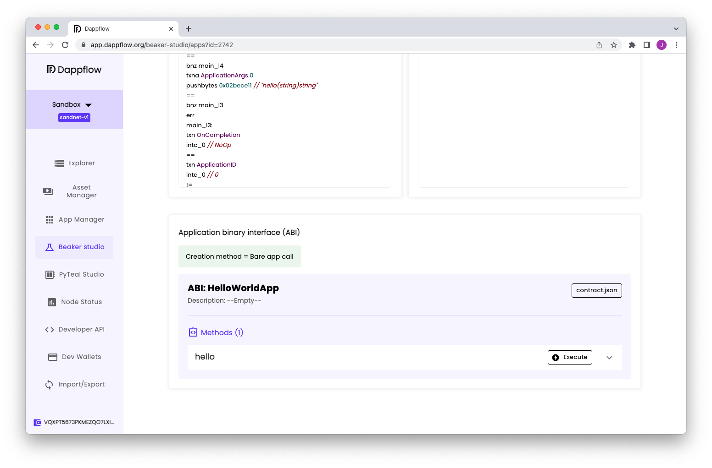
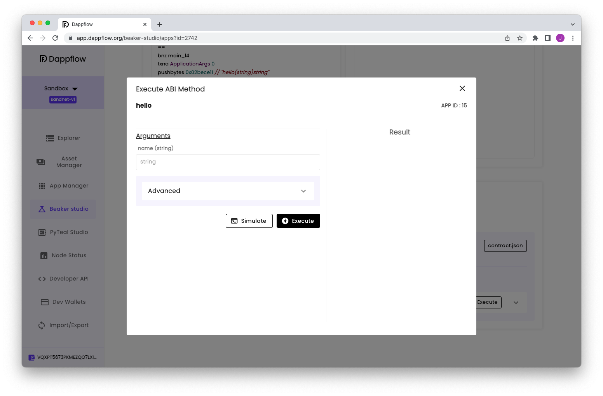
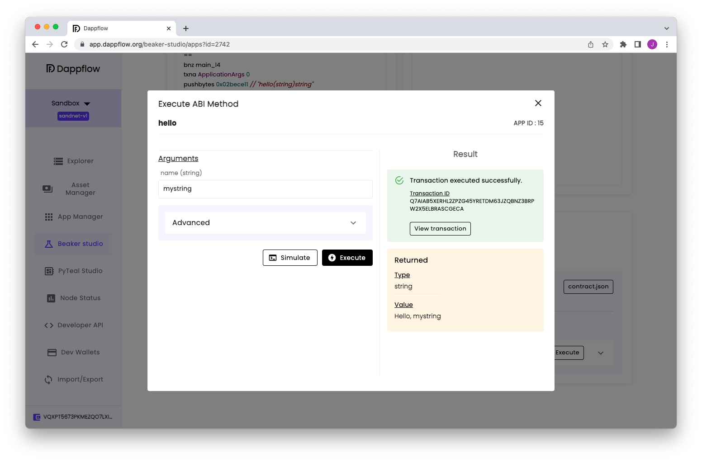

# AlgoKit Quick Start Tutorial

AlgoKit is the primary tool used by the Algorand community to develop smart contracts on the Algorand blockchain. It provides the capabilities to develop, test and deploy Algorand smart contracts within minutes! This guide is intended to help you setup AlgoKit and to start developing your application.

## Quick start videos

If you prefer videos, take a look at this 10 minute guide to getting started.

[](https://www.youtube.com/embed/dow6U8DxOGc)

Detailed video guides for both [Windows](https://www.youtube.com/embed/22RvINnZsRo) and [Mac](https://www.youtube.com/embed/zsurtpCGmgE) are also available.

## Prequisites

This guide presents installing AlgoKit using an OS agnostic procedure. For OS specific instructions take a look that the [AlgoKit install](https://github.com/algorandfoundation/algokit-cli/blob/main/README.md#install) guide.

Using this procedure requires the the following components be installed already

- [Python 3.10](https://www.python.org/downloads/) or higher
- [PipX](https://pypa.github.io/pipx/#on-linux-install-via-pip-requires-pip-190-or-later)
- [Git](https://github.com/git-guides/install-git#install-git)
- [Docker](https://docs.docker.com/desktop/install/mac-install/)
- [VSCode](https://code.visualstudio.com/download)

## Install AlgoKit

To install AlgoKit, run the following command from a terminal.

```shell
pipx install algokit
```

After the installation completes, **restart the terminal**.

For more detailed installation documentation, see the [official installation guide](https://github.com/algorandfoundation/algokit-cli#install).

## Verify the Installation

To verify AlgoKit Installed correctly run the following.

```shell
algokit --version
```

Output similar to the following should be displayed:

```shell
algokit, version 0.5.0
```

## Start a LocalNet

AlgoKit supports using a [local version of the Algorand blockchain](../features/localnet.md). To start an instance of this LocalNet run the following command from the terminal:

```shell
algokit localnet start
```

This should start an instance of the LocalNet within docker. If you open the Docker Desktop application you should something similar to the following:


## Create an AlgoKit project

Now that AlgoKit is installed, you can rapidly create a new project to get started quickly. This can be done by running:

```shell
algokit init
```

This will launch a guided menu system to create a specific project tailored to your needs. You will first be prompted to select a specific template. The templates are basic starter applications for various Algorand development scenarios. To read more about templates checkout AlgoKit detailed documentation. For now, use the arrow keys to select the `playground` template, which is a lightweight starting point for learning and experimentation.

Next, you will be prompted for the name of your project. Finally, select the default value for the rest of the prompts (enter).

Once finished, (if you have it installed) VS Code should automatically be opened with the initialised project and you will be prompted to install appropriate VS Code extensions. This starter app will contain one smart contract (built using the [Beaker](https://beaker.algo.xyz/) smart contract development framework) named `helloworld.py`, in the `hello_world` folder, with one method (`hello`) that takes a `String` and returns a `String`.


## Run the Demo Application

Once the playground project is created, you will notice in the `hello_world` folder a file named `demo.py` which is a simple example of using AlgoKit to deploy and make a call to the `helloworld.py` smart contract on the LocalNet instance started earlier.



Right clicking on this file and selecting `Run Python File in Terminal` will deploy the `HelloWorldApp` smart contract and then call it passing the parameter `name` with a value of `Beaker`. Alternatively, you can hit F5 (or whatever keyboard shortcut is set in VS Code for running the debugger) while you are viewing the `helloworld.py` file and it will:

1. Start LocalNet
2. Build the smart contract
3. Deploy and call the smart contract (`demo.py`)

This should produce something similiar to the following in the VSCode terminal.

```shell
(playground-py3.11) User@Algo-User-MBP myalgokit project % "/Users/user/code/algokit/myalgokit pro
ject/.venv/bin/python" "/Users/user/code/algokit/myalgokit project/playground/hello_world/demo.py"
Deployed app in txid SBNIJYZUOXVPXDFJHAVDDCO5TQ4WZ7P37QOOQM6CSVSMIURETHNQ
        App ID: 11
        Address: 377KDIVHB7K2LFFJIPUPQFWJGVD36MAP4EI6Y2HAGRAW6JPK4MDUBC3YVY

Hello, Beaker
```

The App ID of of the deployed contract and its Algorand address is displayed, followed by the message returned from the smart contract call (`Hello, Beaker`).

At this point you have deployed a simple contract to an Algorand network and called it successfully!

Additionally, you can find the native TEAL smart contract code and the appropriate smart contract manifest JSON files have been output to the `artifacts` folder.



Running the `build.py` python file will also generate these artifacts without deploying. These files can be used by tools like [Dappflow](https://dappflow.org/), [goal](https://developer.algorand.org/docs/clis/goal/goal/), etc. to deploy your smart contract to the various Algorand networks.

## Using Dappflow

Dappflow is a web-based user interface that let's you visualise accounts, transactions, assets and applications on an Algorand network and also provides ability to deploy and call smart contracts. This works for TestNet, MainNet and also LocalNet. Furthermore, you can also create and fund accounts on LocalNet. While AlgoKit surfaces both a programming interface and a command line interface for interacting with Algorand, it also allows you to quickly open Dappflow so you can see what's happening visually.

Dappflow can be launched from AlgoKit by running the following command from the VS Code terminal.

```shell
algokit explore
```

By default it will open Dappflow to point to LocalNet (It will be displayed as `sandnet-v1` in the upper left hand corner.), but you can pass in parameters to point it to TestNet and MainNet too.

This command will launch your default web browser and load the Dappflow web application.

**Note:** If you are using Safari, then it won't work against LocalNet and you will need to open it in a different browser.



### Create test account

To issue commands against the LocalNet network you need an account with ALGOs in it. Dappflow lets you easily create one.

Select `Dev Wallets` from the left menu and click on the `Create wallet` button. This will create an account on the LocalNet and fund it with 100 Algos that can be used to test with.



In the bottom left hand corner of the menu, select `Connect wallet` and you will be prompted with several wallet choices. Choose the `Dev Wallet` option. This will connect the account you just created to Dappflow so you can use that account for signing transactions from the Dappflow user interface.

### Deploy the Hello World application

To deploy the built Beaker smart contract application, select the `Beaker studio` menu and click on the import beaker app. Select `File` and `Upload file`, browse to the artifacts created in the previous section of this guide. Select the `application.json` manifest file. This will load the specific manifest file for the Hello World sample application.



To deploy this application again, select the `Create app` button followed by the `Create` button from the popup. You should get a `Transaction successful` message with the option to view the specific transaction in the explorer. Close out of the popup and then scroll down to the `ABI` section of the page. The `hello` method should be displayed with an execute button beside it.



Click on the Execute button and a popup will be displayed allowing you to enter the parameter that we defined in the `HelloWorldApp` smart contract.



Enter a string in the parameter and click on `Execute`. You should get get a confirmation that the method executed properly and what the smart contract returned.



You have now successfully deployed and executed a smart contract method call using Dappflow!

## Next steps

- To learn more about AlgoKit and what you can do with it, checkout the [AlgoKit documentation](../algokit.md).
- To learn more about Beaker, take a look at the [Beaker documentation](https://beaker.algo.xyz/).
- More information on Algorand smart contracts is also available in the [smart contract documentation](https://developer.algorand.org/docs/get-details/dapps/smart-contracts/).
