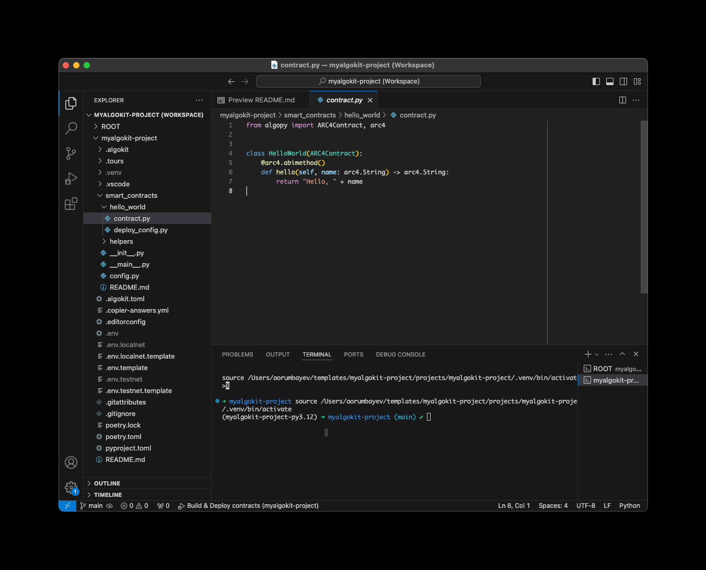

# AlgoKit Quick Start Tutorial

AlgoKit is the primary tool used by the Algorand community to develop smart contracts on the Algorand blockchain. It provides the capabilities to develop, test and deploy Algorand smart contracts within minutes! This guide is intended to help you setup AlgoKit and to start developing your application.

## Quick start videos 📹

If you prefer videos, take a look at this 10 minute guide to getting started.

[](https://www.youtube.com/embed/dow6U8DxOGc)

Detailed video guides for both [Windows](https://www.youtube.com/embed/22RvINnZsRo) and [Mac](https://www.youtube.com/embed/zsurtpCGmgE) are also available.

> Please note, the videos above are to be refreshed to cover v2.0 features. For now, its best to follow the instructions below to get started.

## Prequisites ✅

This guide presents installing AlgoKit using an OS agnostic procedure. For OS specific instructions take a look that the [AlgoKit install](https://github.com/algorandfoundation/algokit-cli/blob/main/README.md#install) guide.

Before proceeding, ensure you have the following components installed:

- [Python 3.10](https://www.python.org/downloads/) or higher
- [pipx](https://pypa.github.io/pipx/#on-linux-install-via-pip-requires-pip-190-or-later)
- [git](https://github.com/git-guides/install-git#install-git)
- [Docker](https://docs.docker.com/desktop/install/mac-install/) (or [Podman](https://podman.io/getting-started/installation/), see [details](../features/localnet.md#podman-support))
- [VSCode](https://code.visualstudio.com/download)

## Install AlgoKit 🛠

To install AlgoKit, run the following command from a terminal.

```shell
pipx install algokit
```

After the installation completes, **restart the terminal**.

For more detailed installation documentation, see the [official installation guide](https://github.com/algorandfoundation/algokit-cli#install).

> Please note, `pipx` is only one of the supported installation methods. You can also install AlgoKit via `brew` and _soon_ `winget` and `snap` as pre-build binaries. Refer to the official installation guide.

## Verify the Installation ✔

To verify AlgoKit Installed correctly run the following.

```shell
algokit --version
```

Output similar to the following should be displayed:

```shell
algokit, version 2.0.3 # or higher
```

## Start a LocalNet 🌐

AlgoKit supports using a [local version of the Algorand blockchain](../features/localnet.md). To start an instance of this LocalNet run the following command from the terminal:

```shell
algokit localnet start
```

This should start an instance of the LocalNet within docker. If you open the Docker Desktop application you should see something similar to the following:


## Create an AlgoKit project 🆕

Now that AlgoKit is installed, you can rapidly create a new project to get started quickly. This can be done by running:

```shell
algokit init
```

This will launch a guided menu system to create a specific project tailored to your needs. The templates are basic starter applications for various Algorand development scenarios. To read more about templates checkout AlgoKit detailed documentation.

For now we'll use the `python` template, which is a lightweight starting point for learning Algorand smart contract development using Algorand Python. You can initialize a project using this template by running:

```shell
algokit init -t python -a preset_name "starter"
```

Next, you will be prompted for the name of your project. Finally, select the default value for the rest of the prompts (enter).

Once finished, (if you have it installed) VS Code should automatically be opened with the initialised project and you will be prompted to install appropriate VS Code extensions. This starter app will contain one smart contract (built using the [Algorand Python](https://algorandfoundation.github.io/puya/) language) named `contract.py`, in the `smart_contracts/hello_world` folder, with one method (`hello`) that takes a `String` and returns a `String`. Notice that within the contract folder, there is a `deploy_config.py` which defines the parameters for deployment of your smart contract to the target chain (Algorand TestNet, Algorand MainNet, Algorand LocalNet or else).



## AlgoKit Project structure 🏗

The structure of your fresh algokit project instance will look similar to below:

```bash
.
├── .algokit.toml # Configuration for AlgoKit projects in the workspace.
├── README.md # Quick start guide for the AlgoKit Workspace.
├── {your_workspace|project_name}.code-workspace
└── projects
    └── {your_project_name} # Root directory for the smart contract project. To add more projects into your algokit workspace run 'algokit init' from the root of your workspace repository.
        ├── README.md # Quick start on Algorand Python smart contract template based project.
        ├── .algokit # Hidden folder for AlgoKit AVM debugger and custom generators.
        ├── .algokit.toml # Project-specific commands and custom generator references.
        ├── poetry.lock
        ├── poetry.toml # Dependency definitions for {your_project_name}.
        ├── pyproject.toml # Project definitions for {your_project_name}.
        └── smart_contracts
            ├── README.md # Guide for adding new smart contracts.
            ├── ...
            ├── hello_world # Contract logic for 'hello_world'.
            │   ├── contract.py # Contract logic.
            │   └── deploy_config.py # Deployment logic for 'hello_world'.
            └── helpers # Helper functions for contract build and deployment.
```

Additionally, each official smart contract template includes an interactive codespace walkthrough powered by [CodeTour](https://marketplace.visualstudio.com/items?itemName=vsls-contrib.codetour).

To start the interactive walkthrough, install the extension and click on the green play button in the left bottom corner of the `Explorer` pane as demonstrated on the screenshot below (See `Getting Started with Your AlgoKit Project`).


Upon execution, the walkthrough will guide you through the key components of your fresh AlgoKit project, which is an important prerequisite to learn before running and deploying your first smart contract. Certainly, not because its hard to learn, but because it will save you a lot of time and effort having the correct foundations.

## Run the Demo Application 🏃‍♂️

Once the `Algorand Python` based project is created, you can get started by building and deploying your first smart contract. There are a few possible ways to do so as demonstrated on the following video.

[](https://ipfs.algonode.xyz/ipfs/Qma6gNqxsSFc9Jbh8kBTZyVLv5gqFj1xnrsjoeT6MAAwCw/)

The App ID of the deployed contract and its Algorand address is displayed, followed by the message returned from the smart contract call (`Hello, Python`).

1. Start LocalNet
2. Build the smart contract. Notice how a folder named `artifacts` is created with the [AVM (Algorand Virtual Machine)](https://developer.algorand.org/docs/get-details/dapps/avm/) related artifacts for deploying your smart contract.
3. Deploy and call the `HelloWorld` smart contract (from `contract.py` file).

After execution, the `App ID` of the deployed contract and its Algorand address are displayed, followed by the message returned from the smart contract call (`Hello, world`).

At this point you have deployed a simple contract to a LocalNet Algorand network (running in your Docker environment) and called it successfully!

Additionally, you can find the native AVM related artifacts and the appropriate smart contract manifest JSON files have been output to the `artifacts` folder. Note that in this example, AVM bytecode is compiled using the `PuyaPy` compiler, which is what `Algorand Python` relies on to compile your Python smart contract code to TEAL ([Transaction Execution Approval Language](https://developer.algorand.org/docs/get-details/dapps/avm/teal/)).

### Using AlgoKit CLI to build and deploy contracts 🛠️

When using official AlgoKit templates via `algokit init`, you can manage your projects using the AlgoKit CLI at the convenience of your terminal.

For example, to achieve the same results as in the demo earlier, build and deploy the `HelloWorld` contract from the `contract.py` file by running the following command from the terminal:

```shell
algokit project run build
```

This command will recompile your python contracts from `contract.py` and produce the necessary artefacts for deploying your contract.

```shell
algokit project deploy localnet
```

This will then deploy to your LocalNet instance and display the same output as in the earlier demo.

> Please note, as highlighted in the [structure](#algokit-project-structure) section above, the `project run ...` commands are defined in the respective `.algokit.toml` file under `[project]` sections.

## Next steps 🚶‍♂️

We have only covered a tiny fraction of the capabilities of the AlgoKit CLI and its related ecosystem of templates and utilities for an efficient developer experience.

- To get the most out of `AlgoKit`, we recommend to get started with learning more about AlgoKit and what you can do with it by checking out our extensive [AlgoKit CLI documentation](../algokit.md).
- Explore the `README.md` files at the root of any project created via `algokit init`. All official AlgoKit templates include detailed quick started guides, an interactive code tour and various presets which can be customized to your needs.
- To learn more about `Algorand Python`, take a look at the [documentation](https://algorandfoundation.github.io/puya/).
- To learn more about the commands demonstrated in this tutorial, refer to [`init`](../features/init.md) and [`project`](../features/project.md) to get a comprehensive understanding of their further capabilities.
- If you'd like to learn more on structuring your `AlgoKit Project` as a monorepo, refer to `workspace` mode as described in [`init`](../features/init.md#workspaces-vs-standalone-projects). You can also pass the `--no-workspace` flag to setup a standalone algokit project, if preferred.
- If you'd like to **create your own** `AlgoKit` template, refer to the [template tutorial](./algokit-template.md).
- More information on Algorand smart contracts is also available in the [smart contract documentation](https://developer.algorand.org/docs/get-details/dapps/smart-contracts/).
